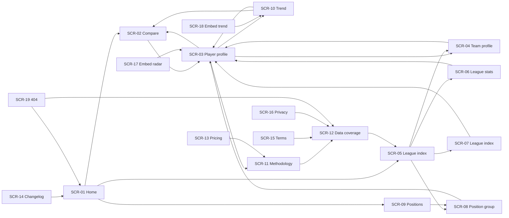
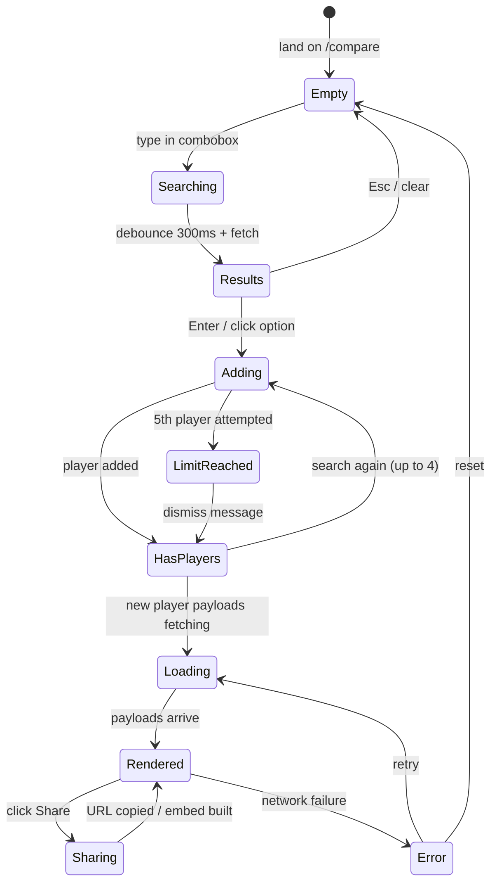
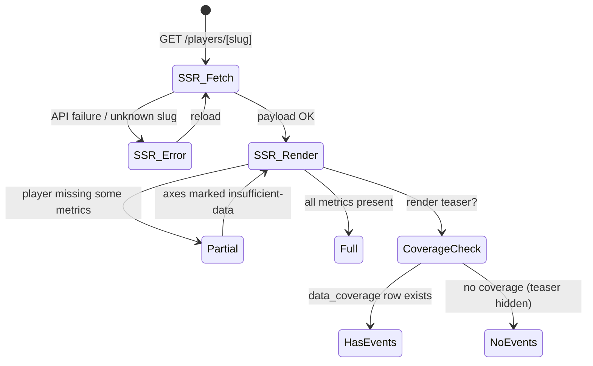
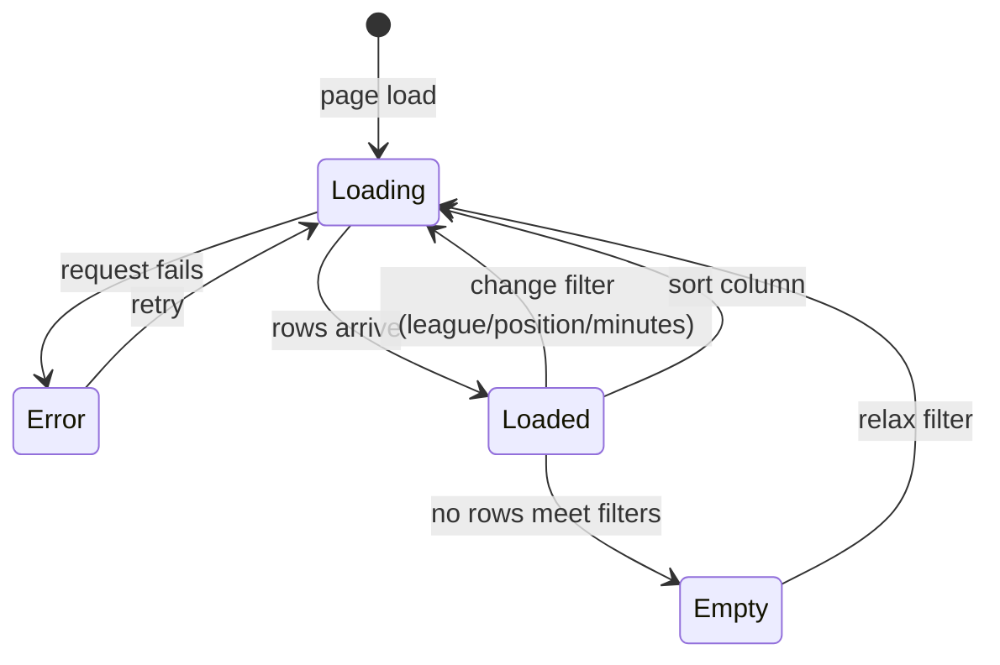

# AppFlow.md — Statlas Application Flow

| Field | Value |
|---|---|
| Version | v0.1 |
| Last Updated | 2026-08-14 |
| Owner | Product Designer + PM |
| Status | In Review |

## 1. Screen Inventory

| ID | Screen | Purpose | Entry points | Exit points | Auth |
|---|---|---|---|---|---|
| SCR-01 | Home `/` | Value prop, league + position navigation | Direct, logo | Any nav | N |
| SCR-02 | Compare `/compare` | Core radar tool (search, add 1–4 players, toggle pct/per-90, share) | Header, home CTA, player page | Player profiles, share | N |
| SCR-03 | Player profile `/players/[slug]` | Header, radar, key stats, data sentence, recency, coverage teaser | Search, leaderboard, similar, home | Compare, team, similar | N |
| SCR-04 | Team profile `/clubs/[leagueSlug]/[teamSlug]` | Roster table + squad radar | League pages, player page team link | Player profiles, league | N |
| SCR-05 | League index `/leagues/[leagueCode]` | League overview + nav to stats/positions | Home, footer | Stats, positions, teams | N |
| SCR-06 | League stats `/leagues/[leagueCode]/stats` | Sortable per-90 stats table | League index | Player profiles | N |
| SCR-07 | League index table `/leagues/[leagueCode]/index` | Statlas Index leaderboard by league | League index | Player profiles | N |
| SCR-08 | Position group `/leagues/[leagueCode]/positions/[group]` | Position-group leaderboard | League index, positions | Player profiles | N |
| SCR-09 | Positions `/positions` | Global position taxonomy overview | Home, footer | Position pages | N |
| SCR-10 | Trend `/trend` | Trend/time-series chart tool | Header, player page link | Player profiles, share | N |
| SCR-11 | Methodology `/methodology` | Formula, weights, normalization, limitations | Footer, home, player page links | — | N |
| SCR-12 | Data coverage `/data-coverage` | What sources/leagues/seasons are actually covered | Footer, dataset banner | — | N |
| SCR-13 | Pricing `/pricing` | Pro-tier teaser (Phase 4 placeholder, no billing) | Footer, home | — | N |
| SCR-14 | Changelog `/changelog` | Release history | Footer | — | N |
| SCR-15 | Legal terms `/legal/terms` | ToS draft display | Footer | — | N |
| SCR-16 | Legal privacy `/legal/privacy` | Privacy policy draft display | Footer | — | N |
| SCR-17 | Embed radar `/(embed)/embed/radar` | Iframe-able radar widget | External embeds | — | N |
| SCR-18 | Embed trend `/(embed)/embed/trend` | Iframe-able trend widget | External embeds | — | N |
| SCR-19 | 404 `/not-found` | Missing page | Any bad URL | Home, data-coverage | N |

## 2. Navigation Map

## 3. Detailed Flows per Journey

### 3.1 Core loop: build a comparison (SCR-02)

### 3.2 Player profile SSR render (SCR-03)

### 3.3 Leaderboard filter/sort (SCR-06/07/08)

## 4. Empty / Loading / Error States

| Screen | Empty | Loading | Error |
|---|---|---|---|
| SCR-02 Compare | "No players selected yet" prompt + search hint | Skeleton radar outline (polygon shape, not gray box) | Error state-block with Retry |
| SCR-02 partial data | — | — | Axes with insufficient data explicitly marked — never plotted as zero |
| SCR-03 Player | Unknown slug → 404 | SSR skeleton | Error state-block |
| SCR-06/07/08 Leaderboard | "No players meet the 900-minute threshold in {league} this season yet — check back after more matches are played" | Skeleton rows | Error + Retry |
| SCR-04 Team | Roster empty → honest note | Skeleton | Error |
| SCR-10 Trend | "No qualifying snapshot data for this player" | Trend skeleton | Error + Retry |
| SCR-11 Methodology | N/A (static SSR) | N/A | N/A |
| SCR-05/09 | N/A (catalog data always seeded) | Skeleton | Error |

## 5. Edge Cases & Branching Logic

| Condition | Route/Behavior |
|---|---|
| 5th player added to compare | Explicit limit message (REQ-005); 4-player max |
| Player below 900-min threshold | Index shows "pending qualification — needs X more minutes"; never 0 |
| Player missing one metric | Axis labeled insufficient-data; radar still renders remaining axes |
| Duplicate search hit (name collision) | Disambiguating context: team, league, position (US-001) |
| `STATLAS_DATASET_MODE != production` | Dataset banner shown on every page |
| StatsBomb coverage absent | Shot/event maps hidden entirely (REQ-012) |
| Share URL with unknown player slug | Decode gracefully; unknown players dropped from comparison |
| Dark theme toggle | `data-theme` attribute swap; tokens re-map (Design.md §11) |
| Reduced motion preference | `prefers-reduced-motion` → shimmer animations disabled |

## 6. Notifications & Re-engagement

**None in v1** — no accounts, no push/email. Re-engagement is via share permalinks (SCR-02 Sharing) and embed widgets (SCR-17/18). N/A because v1 has no auth/user model (PRD §3 Non-Goals).

## 7. Cross-Platform Deltas

| Surface | Delta |
|---|---|
| Mobile (375px) | Mobile menu replaces top nav; tables scroll in `.table-wrap`; combobox full-width |
| Tablet (768px) | Grid shifts 4→6 columns; multi-column stat lists |
| Desktop (1440px) | 12-column grid; full nav |
| Print | `.no-print` hides header/footer/banner; light-on-white (tokens `@media print`) |

All breakpoints verified automatically with no-horizontal-overflow assertions in both themes (Testing.md §4).

## 8. Related Documents

| Document | Relationship |
|---|---|
| [PRD.md](PRD.md) | User stories/REQs behind each screen |
| [TechSpec.md](TechSpec.md) | Components powering screens |
| [Design.md](Design.md) | Visual states for the states above |
| [Schema.md](Schema.md) | Data behind SCR-03/04/06/07/08 |
| [ImplementationPlan.md](ImplementationPlan.md) | Tasks per screen |
| [Tracker.md](Tracker.md) | Screen status |
| [Rules.md](Rules.md) | A11y rules applied to all states |
| [API.md](API.md) | Endpoints each screen calls |
| [SecurityAndCompliance.md](SecurityAndCompliance.md) | N/A (no auth surfaces) |
| [Testing.md](Testing.md) | e2e coverage per journey |
| [Deployment.md](Deployment.md) | Where screens deploy |
| [Glossary.md](Glossary.md) | Screen terms |
| [RiskRegister.md](RiskRegister.md) | Risks affecting flows |
