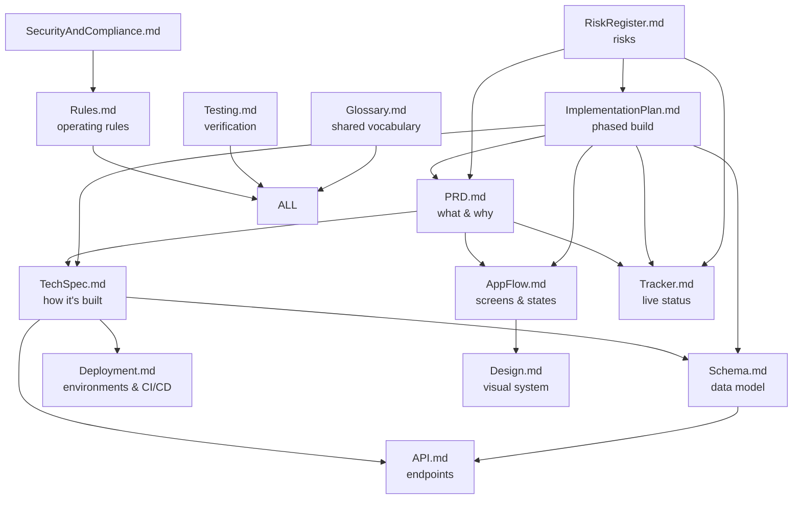

# Doc Suite Map — Statlas project-documentation suite

> Home: `docs/suite/` (moved from `project-docs/` at the repo root in the 2026-08-14 docs merge).

| Field | Value |
|---|---|
| Version | v0.1 |
| Last Updated | 2026-08-14 |
| Owner | TPM |
| Status | In Review |

## Suite Map

Every file links to every other file via its **Related Documents** table (13 rows each); IDs (REQ/SCR/EP/TBL/TASK/US/RULE/RISK/BLK) are unique across the suite and cross-linked bidirectionally.

## Consistency Report (Quality Gate output)

- **Task parity:** all 37 `TASK-#.#` in ImplementationPlan.md appear in Tracker.md with a status (30 🟢, 2 🟡, 5 ⚪); zero orphans either direction.
- **ID integrity:** 122 unique IDs across the suite; every REQ-### referenced outside PRD.md resolves to a PRD definition (0 unknown refs); 65 IDs are cross-referenced in 2+ files (expected — that's the linking working).
- **Link integrity:** all 182 internal `.md` links resolve to real files in `docs/suite/` (0 broken).
- **Diagram requirements:** every file meets its minimum diagram count (PRD 2, TechSpec 4, AppFlow 4, Design 1, Schema 1, ImplementationPlan 2, Tracker 1, Rules 1, RiskRegister 1); Design.md's component anatomy is ASCII per spec allowance.
- **Metadata + TBD rules:** all 14 files carry the version/owner/status header and a Related Documents table; the only "TBD" strings carry owner + resolve-by (Tracker dashboard "Days to Target Launch" and Schema retention), plus Rules.md's intentional anti-pattern row.
- **Assumptions made (labeled):** dates for completed phases are approximate (from git history/Tracker changelog); target-launch date is owner-assigned TBD; staging/prod URLs are planned values per infra-plan.md, not live.

## File Index

| File | Purpose | Primary audience |
|---|---|---|
| [PRD.md](PRD.md) | Product requirements, personas, REQs | Founder, PM |
| [TechSpec.md](TechSpec.md) | Architecture, stack, NFRs, integrations | Engineers |
| [AppFlow.md](AppFlow.md) | Screens, states, journeys | Designers, PM, QA |
| [Design.md](Design.md) | Tokens, typography, components, a11y | Designers, frontend |
| [Schema.md](Schema.md) | 11 tables, ER, migrations, sensitive data | Backend, DBAs |
| [ImplementationPlan.md](ImplementationPlan.md) | Phased plan, tasks, DoD | Engineers, PM, AI agents |
| [Tracker.md](Tracker.md) | Live status dashboard | Everyone |
| [Rules.md](Rules.md) | Engineering + AI-agent constitution | Engineers, AI agents |
| [API.md](API.md) | All /api/v1 endpoints | Integration |
| [SecurityAndCompliance.md](SecurityAndCompliance.md) | Threat model, compliance checklist | Security, legal |
| [Testing.md](Testing.md) | Test pyramid, gates, e2e | QA, engineers |
| [Deployment.md](Deployment.md) | Environments, CI/CD, rollback | DevOps |
| [Glossary.md](Glossary.md) | Shared vocabulary | Everyone |
| [RiskRegister.md](RiskRegister.md) | Risks, mitigations, owners | PM, leadership |

**Start here:** read [PRD.md](PRD.md) → [TechSpec.md](TechSpec.md) → [Rules.md](Rules.md) → [Tracker.md](Tracker.md), then branch into whatever layer you're working on.
