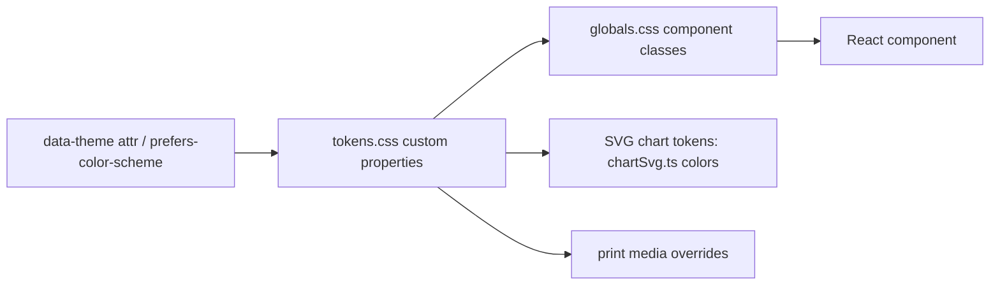

# Design.md — Statlas Design System & UX Principles

| Field | Value |
|---|---|
| Version | v0.1 |
| Last Updated | 2026-08-14 |
| Owner | Design Lead |
| Status | In Review |

Source of truth: `web/styles/tokens.css` + `web/app/globals.css`. This document is the human-readable contract for those token files.

## 0. Token Flow (how a component resolves its look)



Design tokens are the single source of visual truth: components reference `var(--token)` only (Rules.md RULE-008), themes remap tokens, and SVG charts reuse the same values so charts match UI in both themes.

## 1. Design Principles

| # | Principle | Rationale | Do | Don't |
|---|---|---|---|---|
| 1 | **Clarity over cleverness** | Analytics users need comprehension, not surprise | Show unit/definition per metric axis | Decorative-only charts |
| 2 | **Never color alone** | Constitution: information must not rely on color | Pair player colors with name/initials legend | Rainbow-only distinction |
| 3 | **Honesty about data** | Credibility is the product | Label recency + dataset mode visibly | Imply coverage that doesn't exist |
| 4 | **Numbers are typography** | Stat tables deserve tabular figures | `font-variant-numeric: tabular-nums` everywhere stats appear | Proportional digits in tables |
| 5 | **Accessible by default** | WCAG 2.1 AA is a gate, not a stretch goal | Keyboard-nav combobox, SVG text axes | Canvas-only charts |
| 6 | **Motion with meaning** | Shimmer = loading; nothing decorative | Skeleton shimmer, subtle hover | Bounce/parallax effects |

## 2. Brand & Visual Identity

- **Tone of voice:** confident, precise, understated. Copy states numbers and their limits ("ranked p37 among CMs in the Premier League"), never hype ("unlock your edge!").
- **Imagery:** no stock photos. Player/club photos are honest placeholders (initials block) until licensed assets exist (Constitution imagery rule). Logo: `<!-- TODO: add assets/logo.svg -->` — wordmark, pitch-green on transparent (README).
- **Colors grounded in pitch: green + chalk + one amber accent.** No AI-app indigo/violet (Phase 0 mandate).

## 3. Color System

Key tokens (full set in `tokens.css`; contrast ratios verified in design-system.md §C1):

| Token | Hex | Usage | Contrast vs. surface (light) |
|---|---|---|---|
| `--color-primary` | #1E7A4C (pitch green) | Primary buttons, brand | ≥ 4.5:1 (AA) |
| `--color-primary-hover` | darker green | Button hover | ≥ 4.5:1 |
| `--color-accent` | #A85F0E (amber) | Data emphasis, dataset banner | 4.47:1 → hover variant used for text (#8A4B0B ≈ 6.3:1) |
| `--color-surface` | near-white chalk | Page bg | — |
| `--color-surface-raised` | white | Cards | — |
| `--color-surface-sunken` | gray tint | Inputs, chips | — |
| `--color-text-primary` | near-black | Body | ≥ 12:1 |
| `--color-text-secondary` | gray | Secondary text | ≥ 4.5:1 |
| `--color-text-muted` | mid gray | Labels, hints | ≥ 4.5:1 |
| `--color-text-disabled` | light gray | Disabled | n/a (non-interactive) |
| `--color-border` / `--color-border-strong` | gray pair | Dividers / strong borders | n/a |
| `--color-success` | green | Positive deltas | ≥ 4.5:1 |
| `--color-warning` | amber | Warnings, anomaly rings | ≥ 4.5:1 |
| `--color-danger` | red | Errors | ≥ 4.5:1 |
| `--color-link` / `--color-link-hover` | green pair | Links | ≥ 4.5:1 |
| `--color-chart-gridline` | gray | Radar rings/spokes | n/a |
| `--color-chart-label` | gray | SVG axis labels | ≥ 4.5:1 vs chart bg |
| Player palette | Okabe-Ito categorical set | Player overlays (colorblind-safe) | paired with legend (Principle 2) |

## 4. Typography Scale

Modular scale ratio 1.25; heading face = body face (single UI family for weight; data via tabular nums). Tokens: `--text-xs` → `--text-4xl`.

| Token | Size | Weight | Line-height | Usage |
|---|---|---|---|---|
| `--text-xs` | 0.75rem | 400/600 | 1.4 | Hints, footnotes, chips, banner |
| `--text-sm` | 0.875rem | 400/600 | 1.5 | Body secondary, buttons, tables |
| `--text-base` | 1rem | 400/600 | 1.6 | Body |
| `--text-lg` | 1.25rem | 600 | 1.4 | Card titles, section heads |
| `--text-xl` | 1.5625rem | 600 | 1.3 | H2 |
| `--text-2xl` | 1.953rem | 600 | 1.25 | H1 / page titles |
| `--text-3xl` | 2.441rem | 600 | 1.2 | Hero H1 |
| `--text-4xl` | 3.052rem | 700 | 1.15 | Landing hero display |

Numeric rule: all stat values use `font-family: var(--font-data)` with `font-variant-numeric: tabular-nums` + `tnum 1, lnum 1` (applied to `table, .stat, .badge, .percentile, .axis-label, .num`).

## 5. Spacing & Grid System

- **Base unit:** 4px. Tokens `--space-1` (4px) … `--space-9` (36px) + `--space-12` (48px).
- **Grid:** 12-column desktop (`repeat(12, minmax(0,1fr))`), 6-col tablet, 4-col mobile. Span utilities: `grid__span-3/4/6/8` (span-2/span-12 removed as dead in cleanup audit).
- **Container:** `.container` max-width `--container-lg`; `.container--xl` for header/footer.

| Breakpoint | Token | Grid columns | Layout notes |
|---|---|---|---|
| 375px (mobile) | `--bp-mobile` | 4 | Stack cards; mobile menu; full-width combobox |
| 768px (tablet) | `--bp-tablet` | 6 | Two-col stat lists; footer 4-col |
| 1440px (desktop) | `--bp-desktop` | 12 | Full nav; multi-col hero |

## 6. Component Library

### 6.1 Button (`button`, `button--secondary`, `button--ghost`, `button--sm`, `button--active`, `icon-button`)
States: default / hover / active / disabled (`[disabled]` or `[aria-disabled=true]`) / focus-visible (focus ring token).

```
┌────────────────┐
│  Label         │  40px min-height, --radius-md
└────────────────┘
```

### 6.2 Input / Select (`input`, `select`)
States: default / hover (border strong) / disabled / focus-visible; `::placeholder` muted. Search combobox adds `.combobox__input` (left icon padding).

### 6.3 Card (`card`, `card--sunken`, `card--flush`, `radar-card`, `position-card`)
Default = raised surface + border + shadow-sm. `--sunken` = dashed border (used for state blocks). `--flush` = padding 0, overflow hidden.

### 6.4 Radar chart (`radar-card` → `radar-svg-wrap` → `radar-svg`)
SVG anatomy: rings (`radar-ring`), spokes (`radar-spoke`), polygons (`radar-poly`, fill-opacity 0.18, hover 0.3), vertex markers (`radar-vertex`, focusable), axis labels (`axis-label`, SVG text — selectable), tooltip (`radar-axis-tooltip`), legend (`radar-legend__item` with `radar-legend__swatch`).

### 6.5 Table (`table-wrap` → `table`, `table--sticky-first`, `th-sort`)
Scroll wrapper for overflow; sticky header; sticky first column variant; sort indicators (`th-sort__arrow`) — sort state conveyed by arrow **plus** `aria-sort`, never color alone.

### 6.6 State blocks (`state-block`, `state-block--sunken`, `state-block--error`)
Loading = skeleton; empty = sunken dashed block with real copy (AppFlow.md §4); error = danger-left-border block with Retry action.

### 6.7 Chips / badges (`chip`, `chip--accent/primary/danger`, `badge`, `percentile`)
Position-group and metric chips; percentile badge ("p37") uses `--color-pct-text-N` text-safe ramp.

### 6.8 Modal/panel: SharePanel (`share-panel`)
Rows for URL, OG preview, embed code; feedback message (`share-panel__feedback`, success green / `--error` red).

## 7. Iconography & Imagery

- **Library:** lucide-react, 1.5 stroke weight site-wide, 16px default.
- **Rules:** icons are decorative helpers, never sole conveyors of meaning (paired with text or aria-labels).
- **Imagery policy:** placeholders only (`.avatar-placeholder`, initials) until licensed assets; OG images are generated SVG→PNG of the actual chart (not a banner) — `lib/ogRender.tsx`, `lib/chartSvg.ts`.

## 8. Accessibility Standards

- **Target:** WCAG 2.1 AA, enforced by `@axe-core/playwright` in CI (fails on any violation).
- **Keyboard:** full combobox nav (arrows + Enter + Esc, `aria-activedescendant`), focus-visible rings, skip-link.
- **Screen readers:** radar axes are SVG text; visually-hidden tables carry full axis data for SRs (`.visually-hidden` off-screen positioning fix from e2e debugging); `aria-sort` on table headers; `aria-pressed` on segmented toggles; `role="status"` on state blocks.
- **Motion:** `prefers-reduced-motion` honored (shimmer/transitions disabled).

## 9. Responsive Behavior

| Breakpoint | Header | Content | Tables |
|---|---|---|---|
| < 640px | Hamburger + mobile menu | Single column; hero stacks | Scroll inside `.table-wrap` |
| 640–1023px | Full nav (≥1024) | 6-col grid | `.table-wrap` scroll |
| ≥ 1024px | Full nav | 12-col grid | Sticky first column |

Verified: no horizontal overflow at 375/768/1440 in light+dark (Playwright breakpoint suite — Testing.md §4).

## 10. Motion & Micro-interactions

| Token | Value | Used for |
|---|---|---|
| `--duration-fast` | 150ms | hover/active transitions |
| `--duration-base` | 250ms | theme swap, panel |
| `--ease-out` / `--ease-in-out` | cubic-bezier | transitions / shimmer |
| Shimmer | 2.5s infinite | skeleton loading (disabled under reduced-motion) |

Nothing animated decoratively; motion communicates loading or state change only.

## 11. Dark Mode / Theming

`data-theme="light"|"dark"` attribute + `prefers-color-scheme` fallback. Token mapping table lives in `tokens.css` §dark; key deltas: `--color-surface` → dark chalk, `--color-text-primary` → light, chart gridlines → dimmed, `pitch__surface` → `--pitch-900`. ThemeToggle component persists choice; e2e runs both themes at all breakpoints.

## 12. Related Documents

| Document | Relationship |
|---|---|
| [PRD.md](PRD.md) | REQs driving component behavior |
| [TechSpec.md](TechSpec.md) | Components implement these tokens |
| [AppFlow.md](AppFlow.md) | Screens consume components; state tables map to component states |
| [Schema.md](Schema.md) | N/A (no schema impact) |
| [ImplementationPlan.md](ImplementationPlan.md) | Design tasks |
| [Tracker.md](Tracker.md) | Design tokens status |
| [Rules.md](Rules.md) | RULE: cross-check Design.md before building UI |
| [API.md](API.md) | N/A |
| [SecurityAndCompliance.md](SecurityAndCompliance.md) | Contrast/a11y compliance |
| [Testing.md](Testing.md) | Axe + breakpoint verification of this system |
| [Deployment.md](Deployment.md) | N/A |
| [Glossary.md](Glossary.md) | Token/term definitions |
| [RiskRegister.md](RiskRegister.md) | N/A |
