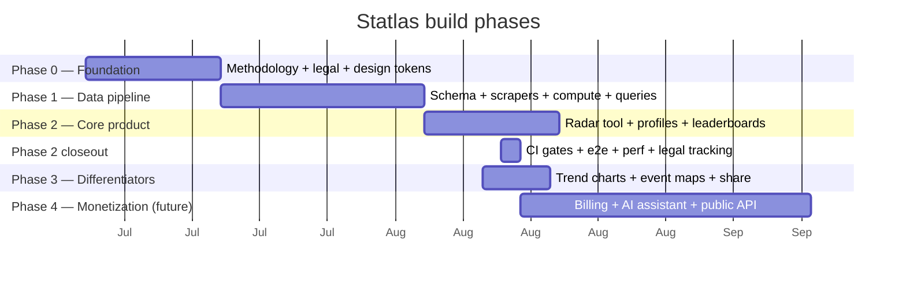
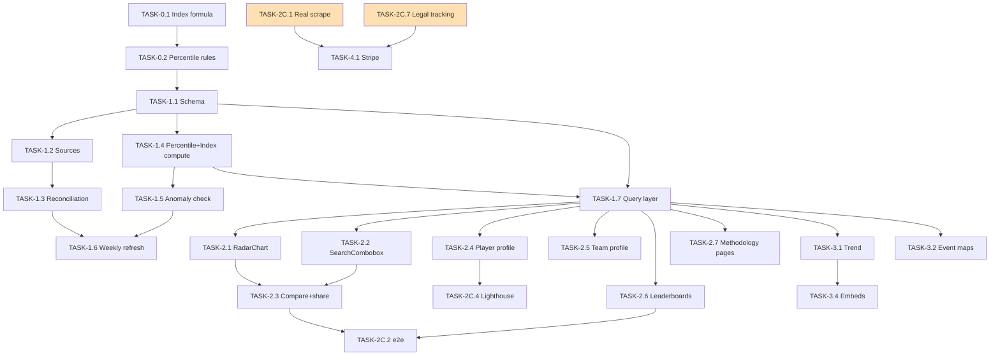

# ImplementationPlan.md — Statlas Phased Build Plan

| Field | Value |
|---|---|
| Version | v0.1 |
| Last Updated | 2026-08-14 |
| Owner | Technical Program Manager |
| Status | In Review |

## 1. Build Philosophy

**Walking skeleton first, vertical slices, ship-and-verify daily.** Phase 0 locked methodology + tokens before any code (so nothing was built on unexamined assumptions); Phase 1 built the data spine (schema → scrapers → compute → queries) with tests at every layer; Phase 2 shipped user-facing surfaces (radar, profiles, leaderboards) consuming the Phase 1 query layer directly. Quality gates (axe, Lighthouse, e2e, breakpoints) are CI-enforced, not one-time manual passes. Phases 3–4 (differentiators, monetization) build **on top of** the proven foundation.

> Note: Phases 0–2 (and much of Phase 3) are **already built and committed** — this plan documents what happened and what remains, so Tracker.md stays the single source of truth. Remaining work is marked accordingly.

## 2. Phase Overview

## 3. Phase Breakdown

### Phase 0 — Foundation (✅ done)
**Goal:** lock methodology, legal groundwork, and the design token system before any code.
**Entry:** Constitution approved. **Exit:** all 9 Phase-0 artifacts committed (methodology.md, percentile-rules.md, data-compliance-notes.md, legal drafts, checklist, tokens.css, component-states-spec.md, design-system.md).

| TASK | Description | Depends on | Owner | Effort | Maps to |
|---|---|---|---|---|---|
| TASK-0.1 | Define Statlas Index: metrics, per-position weights, normalization, 900-min threshold | — | Founder | 2d | PRD §3, REQ-015 |
| TASK-0.2 | Percentile rules: league-tier grouping, weekly recalc, immutable history | TASK-0.1 | Founder | 1d | Schema TBL-percentile_snapshots |
| TASK-0.3 | Compliance notes + rate limits per source | — | Founder | 2d | TechSpec §5 |
| TASK-0.4 | ToS / Privacy drafts + founder legal checklist | — | Founder | 2d | SecurityAndCompliance §6 |
| TASK-0.5 | tokens.css + design-system.md + component-state specs | — | Design | 3d | Design.md |

### Phase 1 — Data pipeline (✅ done)
**Goal:** working, tested ingestion + computation + internal query layer.
**Entry:** Phase 0 artifacts approved. **Exit:** 104 pytest green; scrapers fixture-tested; Postgres parity verified.

| TASK | Description | Depends on | Owner | Effort | Maps to |
|---|---|---|---|---|---|
| TASK-1.1 | schema.sql (11 tables) + SQLAlchemy models | TASK-0.2 | Eng | 3d | Schema.md |
| TASK-1.2 | StatsSource ABC + FBref/Understat/StatsBomb/API-Football sources | TASK-1.1 | Eng | 5d | TechSpec §3.4, §5 |
| TASK-1.3 | reconciliation module + alias table flow | TASK-1.2 | Eng | 2d | TBL-player_name_aliases |
| TASK-1.4 | percentile + index compute (weights from registry) | TASK-1.1 | Eng | 3d | TBL-percentile_snapshots |
| TASK-1.5 | anomaly_check + publish gate | TASK-1.4 | Eng | 2d | TBL-ingestion_anomalies |
| TASK-1.6 | weekly_refresh orchestration (idempotent) | TASK-1.3–1.5 | Eng | 2d | TechSpec §3.5 |
| TASK-1.7 | query layer: player/leaderboard/coverage/trend/event/similar/sentences/league/team | TASK-1.1 | Eng | 3d | API.md |
| TASK-1.8 | closeout C1: tier dimension on percentile unique key + migration | TASK-1.4 | Eng | 1d | Schema §4 uq_pct_slot |

### Phase 2 — Core product (✅ done)
**Goal:** radar tool + SEO profile pages + leaderboards on real (fixture-labeled) data.
**Entry:** Phase 1 query layer green. **Exit:** 9 e2e green; axe 0 violations; Lighthouse LCP < 2.5s in CI.

| TASK | Description | Depends on | Owner | Effort | Maps to |
|---|---|---|---|---|---|
| TASK-2.1 | RadarChart SVG component + all states (skeleton/empty/partial/error/limit) | TASK-1.7 | Eng | 4d | REQ-001/002/003/005, SCR-02 |
| TASK-2.2 | SearchCombobox (alias search, keyboard nav) | TASK-1.7 | Eng | 2d | US-001, SCR-02 |
| TASK-2.3 | Compare tool with URL-state + share + OG | TASK-2.1/2.2 | Eng | 3d | REQ-007, SCR-02 |
| TASK-2.4 | Player profile SSR + data sentence + recency + coverage teaser | TASK-1.7 | Eng | 3d | REQ-008/009/011/012, SCR-03 |
| TASK-2.5 | Team profile SSR | TASK-1.7 | Eng | 2d | REQ-010, SCR-04 |
| TASK-2.6 | Leaderboards: sortable/filterable/paginated | TASK-1.7 | Eng | 2d | REQ-013, SCR-06/07/08 |
| TASK-2.7 | Methodology + data-coverage pages | TASK-1.7 | Eng | 1d | REQ-015/017, SCR-11/12 |
| TASK-2.8 | IA: site-map + navigation + slug scheme | — | Eng | 1d | SCR inventory |

### Phase 2 closeout — Quality gates (✅ done)
**Goal:** replace manual verification with CI-enforced gates; close deferred engineering items.
**Entry:** Phase 2 surfaces live. **Exit:** all Part E checklist boxes checked or explicitly re-scoped.

| TASK | Description | Depends on | Owner | Effort | Maps to |
|---|---|---|---|---|---|
| TASK-2C.1 | Real scrape validation (Understat/StatsBomb live; FBref blocked — RISK-01) + production-validation-log | TASK-1.6 | Eng | 3d | PRD Release Criteria |
| TASK-2C.2 | Playwright e2e: radar gen + search/filter + axe on 4 pages | TASK-2.3/2.6 | Eng | 2d | Testing.md §3 |
| TASK-2C.3 | Breakpoint suite (375/768/1440, light+dark, no overflow) | TASK-2.3 | Eng | 1d | Testing.md §4 |
| TASK-2C.4 | Lighthouse CI with failing LCP < 2.5s threshold | TASK-2.4 | Eng | 1d | TechSpec §6 |
| TASK-2C.5 | Tier-completeness regression test + timezone policy + Postgres parity docs | TASK-1.8 | Eng | 1d | Rules.md RULE-005 |
| TASK-2C.6 | gitleaks + pip-audit + npm audit + Dependabot in CI | — | Eng | 1d | SecurityAndCompliance §4 |
| TASK-2C.7 | legal/pre-launch-human-actions.md tracked checklist | TASK-0.4 | Founder | 0.5d | SecurityAndCompliance §6 |

### Phase 3 — Differentiators (✅ done + verified 2026-08-14)
**Goal:** trend charts, event maps, shareable permalinks, embeds on top of Phase 2 architecture.
**Entry:** Phase 2 stable. **Exit:** trend + maps coverage-gated; share/embed working.
**Verification:** every Part A–D item of the Phase 3 prompt audited against code and tests in [`docs/engineering/phase3-verification-log.md`](../engineering/phase3-verification-log.md) (CI run `31806249020` green: 15/15 e2e incl. axe-on-pitch + embed gates, 104 pytest, 12 node).

| TASK | Description | Depends on | Owner | Effort | Maps to |
|---|---|---|---|---|---|
| TASK-3.1 | Trend queries + TrendChart SVG (gaps, transfers) | TASK-1.7 | Eng | 3d | REQ-018, SCR-10 |
| TASK-3.2 | Shot/pass maps from match_events (coverage-gated) | TASK-1.7 | Eng | 2d | REQ-019, SCR-03 |
| TASK-3.3 | Share permalinks + OG images rendering the chart | TASK-2.3 | Eng | 2d | REQ-007 |
| TASK-3.4 | Embed widgets (radar/trend iframes) | TASK-3.1 | Eng | 1d | REQ-020, SCR-17/18 |

### Phase 5 — Launch readiness (✅ built + tested 2026-08-14)
**Goal:** real, defensible launch content; a soft launch to a bounded expert audience; a changelog + iteration discipline that continues past launch.
**Entry:** Phase 4 green. **Exit:** Part D gates met — methodology matches code (worked example verified), no aspirational copy, dogfooding done with 0 blockers, soft-launch package ready, changelog live with Phase 4/5 entries, post-launch cadence documented.
**Verification:** 7-test phase5 e2e spec green (axe on new pages + content-honesty assertions); `scripts/audit_sentences.py` clean across all 1,191 published players; suite task parity check clean. Launch package: `docs/launch/`.

| TASK | Description | Depends on | Owner | Effort | Maps to |
|---|---|---|---|---|---|
| TASK-5.1 | Methodology worked example (real player, real numbers) + About page | TASK-4.4 | Eng | 1d | REQ-015, SCR-11 |
| TASK-5.2 | Pricing FAQ (freshness, cancellation, downgrade) + Help page + report-an-issue on player/team pages | TASK-4.1 | Eng | 1d | REQ-021 |
| TASK-5.3 | Full-dataset sentence audit script (scripts/audit_sentences.py) | TASK-1.7 | Eng | 0.5d | REQ-009 |
| TASK-5.4 | Soft-launch package: plan, post, feedback channel, triage log, go/no-go criteria | TASK-5.1–5.3 | Founder | 1d | PRD Release Criteria |
| TASK-5.5 | Changelog backfill (Phase 4/5 entries) + post-launch iteration cadence doc | — | Founder | 0.5d | REQ-024 |

### Phase 4 — Monetization & polish (✅ built + tested 2026-08-14)
**Goal:** Pro billing, AI assistant, public API — gated behind validated data + legal sign-off.
**Entry:** RISK-01/03/04 cleared (validated FBref run; StatsBomb license re-verified; lawyer-approved legal docs). **Exit:** Stripe checkout e2e passing; Pro features gated.
**Status:** TASK-4.1–4.4 implemented and green (131 pytest + phase4 e2e). Part E live-key gates remain manual + founder-owned: real Stripe test-mode checkout, 10 varied live assistant queries, live-key API calls. Security review: `docs/engineering/phase4-security-review.md`. Billing config: `docs/billing/pricing-config.md`.

| TASK | Description | Depends on | Owner | Effort | Maps to |
|---|---|---|---|---|---|
| TASK-4.1 | Stripe billing: plans, checkout, webhooks, subscription state | RISK-01/03/04 cleared | Eng | 5d | REQ-021 |
| TASK-4.2 | Pro-tier feature gating (radar export, embeds, full history) | TASK-4.1 | Eng | 3d | REQ-021 |
| TASK-4.3 | AI assistant (natural-language queries over query layer) | TASK-4.1 | Eng | 5d | REQ-022 |
| TASK-4.4 | Public REST API + docs + rate limits | TASK-4.1 | Eng | 4d | REQ-023 |
| TASK-4.5 | Checkout e2e (stubbed in Testing.md §7) | TASK-4.1 | Eng | 1d | Testing.md §7 |

## 4. Dependency Graph

**Critical path to Phase 4:** TASK-2C.1 (real FBref scrape — currently **blocked** by RISK-01) and TASK-2C.7 (legal sign-off) are the only gates between closeout and monetization.

## 5. Environment & Tooling Setup Checklist (first day)

- [ ] `python -m venv .venv` && `pip install -r requirements.txt`
- [ ] `cd web && npm install`
- [ ] `cp .env.example .env` (defaults are fixture-demo safe)
- [ ] `python scripts/seed_dev_db.py` → builds `data/dev.db` through the real pipeline (28s)
- [ ] `DATABASE_URL=sqlite+pysqlite:///./data/dev.db python -m uvicorn app.api.main:app --port 8000`
- [ ] `cd web && npm run dev` (Next on :3000)
- [ ] `python -m pytest -q` → 104 pass; `cd web && npx tsc --noEmit` → clean
- [ ] e2e: `cd web && bash scripts/e2e-server.sh` then `npx playwright test` (production-build based)
- [ ] Perf: `cd web && npx lhci autorun` (against running stack)

## 6. Rollout Strategy

- **Feature flags:** none in v1 (no auth/accounts); dataset mode banner acts as the honest "flag" for fixture vs production data.
- **Canary:** N/A pre-launch (single deploy path; Deployment.md §4).
- **Data migration order:** additive migrations only (scripts/migrations/), forward-only, Postgres-verified.

## 7. Definition of Done (global — applies to every task)

- [ ] Tests written/updated and passing (104 pytest / 12 node / 9 e2e baseline)
- [ ] `ruff check .` and `npx tsc --noEmit` clean
- [ ] Axe audit 0 violations on touched screens
- [ ] No horizontal overflow at 375/768/1440 (both themes) on touched screens
- [ ] Schema changes → Schema.md + migration + parity note updated same PR (RULE-007)
- [ ] Docs updated (PRD/Tracker) — no orphan REQs
- [ ] No lorem/placeholder content; honest empty/error copy
- [ ] Performance: no LCP regression on SSR pages

## 8. Related Documents

| Document | Relationship |
|---|---|
| [PRD.md](PRD.md) | REQ IDs traced above |
| [TechSpec.md](TechSpec.md) | Components built per phase |
| [AppFlow.md](AppFlow.md) | SCR IDs traced above |
| [Design.md](Design.md) | Design tasks per phase |
| [Schema.md](Schema.md) | TBL IDs traced above |
| [Tracker.md](Tracker.md) | Mirrors every TASK here with status |
| [Rules.md](Rules.md) | DoD rules above formalized |
| [API.md](API.md) | Endpoints built per phase |
| [SecurityAndCompliance.md](SecurityAndCompliance.md) | Phase 4 entry gates |
| [Testing.md](Testing.md) | Verification per phase |
| [Deployment.md](Deployment.md) | Rollout per phase |
| [Glossary.md](Glossary.md) | N/A |
| [RiskRegister.md](RiskRegister.md) | RISK-01/03/04 gate Phase 4 |
