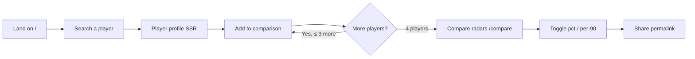
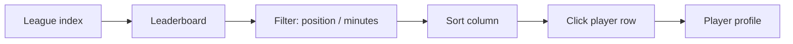

# PRD.md — Statlas Product Requirements Document

| Field | Value |
|---|---|
| Version | v0.1 |
| Last Updated | 2026-08-14 |
| Owner | Founder (product) |
| Status | In Review |

## 1. Executive Summary

Statlas turns the per-90 statistics behind football (FBref/Understat/StatsBomb) into percentile-based radar comparisons and an explainable composite performance metric (the **Statlas Index**, 0–100). Scouts, analysts, and fantasy/UX researchers use it to answer one question in seconds: *"How good is this player, relative to his position group, right now?"* The product is a web app: server-rendered profile pages for SEO, an interactive multi-player radar tool as the core experience, position-group leaderboards, and (Phase 3) trend charts and event maps. It is honest by design — derived metrics, labeled data recency, a visible fixture-demo banner until a real validated scrape run, and no fabricated imagery or statistics (Constitution §7).

## 2. Problem Statement

- **User pain:** Scouting-grade football data is scattered across tables on FBref and Understat, in different units, different seasons, with no position-normalized view. Comparing two players requires manual table gymnastics.
- **Evidence/context:** Existing tools (DataMB) show radar charts but are opaque — no methodology, no per-league normalization explained, no data recency labeling. Statlas's differentiators are transparency (methodology page with the actual formula), accessibility (SVG axes that are selectable text, WCAG AA), and honesty (never imply coverage that doesn't exist).
- **Cost of not solving it:** Scouts burn hours reconciling tables; analysts can't trust a black-box composite; the product forfeits the credibility that a serious analytics tool needs to charge for Pro access (Phase 4).

## 3. Goals & Non-Goals

| Goal | Metric | Target |
|---|---|---|
| Radar comparison is the primary workflow | Share of sessions reaching `/compare` with ≥2 players | ≥ 40% of engaged sessions |
| Profiles are SEO-visible | Player/team pages indexed with dynamic titles/descriptions/OG | 100% of shipped pages indexed |
| Users trust the numbers | Methodology page visited on ≥ 5% of sessions; dataset banner understood | No "is this real?" support threads |
| Performance | LCP on SSR profile pages | < 2.5s (Constitution §4) |
| Data honesty | `data_coverage` gates every feature that depends on a source | Zero false "available" badges |

**Non-Goals (v1):** no user accounts/teams of interest (post-v1); no live matchday data; no video; no betting odds; no mobile native apps (responsive web only); no crowd-sourced scouting notes; no public REST API for third parties until Phase 4.

## 4. Target Users & Personas

| Persona | Role | Goals | Frustrations | Quote | Tech comfort |
|---|---|---|---|---|---|
| **Marco, 34 — club scout** | Regional scout, mid-table club | Compare a shortlist of 3–4 wingers across leagues quickly; check a prospect's percentile vs position group | DataMB has no methodology; FBref tables are raw per-90 with no normalization | "I need the same axis for every player — I can't mentally normalize four different tables." | Medium |
| **Elena, 29 — football analyst** | Analytics consultant, writes scouting reports | Cite a defensible composite metric; explain *why* a player ranks where they do | Black-box indices she can't reproduce | "If I can't see the formula, I can't put it in a report." | High |
| **Sam, 41 — fantasy/UX researcher** | Fantasy football content creator | Find under-the-radar players by position group; embed shareable comparisons | Shareable comparison links that expire or break | "Give me a link I can paste into a tweet that actually shows the radar." | High |
| **Dev (internal), 26 — full-stack engineer** | Builds/maintains the product | Predictable docs, stable URLs, enforced CI | Undocumented schema changes; flaky e2e | "If Tracker.md says done, tests pass." | Very high |

## 5. User Stories

| ID | As a... | I want to... | So that... | Priority | Acceptance Criteria |
|---|---|---|---|---|---|
| US-001 | Scout | search any player by name/alias and see team/league/position context | I pick the right "Mohamed Salah" (there are several) | P0 | Debounced search hits aliases; results show team+league+position; keyboard navigable |
| US-002 | Scout | overlay 2–4 players on one radar | I compare a shortlist on identical axes | P0 | 1–4 players; 5th attempt shows explicit limit message; legend pairs color+name |
| US-003 | Scout | toggle percentile ↔ raw per-90 view | I see both relative standing and actual output | P0 | Toggle updates axis scale + values; no color-only information |
| US-004 | Analyst | read each axis's definition on hover | I know exactly what "PAdj Interceptions" means | P0 | Tooltip/info shows metric name + unit/definition per axis |
| US-005 | Analyst | see a generated, factual data-driven sentence on a player page | I can quote it in a report | P0 | Sentence is computed from real percentile data, never static |
| US-006 | Scout | see similar players ranked by real similarity | I widen a shortlist without guessing | P1 | Nearest-neighbor over percentile vectors within position group; similarity basis stated |
| US-007 | Analyst | know how fresh the data is | I don't cite stale numbers | P0 | Recency line + qualifying season labeled on every profile |
| US-008 | Sam | share a comparison via permalink/OG image | I can post it and it renders correctly | P1 | Share panel builds URL; OG image renders the radar, not a banner |
| US-009 | Analyst | sort/filter a leaderboard by any column | I find "most progressive passes among CMs ≥ 900 min" | P0 | Every column sortable with accessible sort indicator; league/position/minutes filters |
| US-010 | Analyst | read the exact index formula and weights | I trust the composite | P0 | /methodology shows formula, weighting table, normalization, threshold, limitations |
| US-011 | Analyst | know whether shot/event data exists before looking | I never chase a feature that isn't there | P0 | Coverage-gated UI; absent coverage hides the feature entirely |
| US-012 | Scout | see honest loading/empty/error states | I know the tool is working vs. broken | P0 | Skeleton radar; explicit empty prompt; error + retry; no silent zeros |

## 6. Feature List

### Epic E1 — Radar tool (core)
| ID | Feature | Priority | Status |
|---|---|---|---|
| REQ-001 | Multi-player radar overlay (1–4 players, distinct accessible colors + legend) | P0 | ✅ Shipped |
| REQ-002 | Percentile ↔ raw per-90 toggle with correct axis scaling | P0 | ✅ Shipped |
| REQ-003 | Axis metric definitions via hover/info tooltip | P0 | ✅ Shipped |
| REQ-004 | Search-as-you-type with alias resolution + disambiguating context | P0 | ✅ Shipped |
| REQ-005 | Full state coverage: skeleton / empty / partial-data / error / 5th-player-limit | P0 | ✅ Shipped |
| REQ-006 | Similar players (nearest-neighbor on percentile vectors, stated basis) | P1 | ✅ Shipped |
| REQ-007 | Shareable radar permalink + OG image rendering the chart | P1 | ✅ Shipped |

### Epic E2 — Profile pages
| ID | Feature | Priority | Status |
|---|---|---|---|
| REQ-008 | SSR player profile: header, embedded radar, key-stat table, recency label | P0 | ✅ Shipped |
| REQ-009 | Programmatic data-driven sentence (never static) | P0 | ✅ Shipped |
| REQ-010 | SSR team profile: roster table, squad radar, honest logo placeholder | P0 | ✅ Shipped |
| REQ-011 | Dynamic SEO metadata + JSON-LD (Person / SportsTeam) + per-player OG image | P0 | ✅ Shipped |
| REQ-012 | Coverage-gated shot/event teaser (shown only when `data_coverage` confirms) | P1 | ✅ Shipped |

### Epic E3 — Leaderboards & browsing
| ID | Feature | Priority | Status |
|---|---|---|---|
| REQ-013 | Sortable, filterable, paginated leaderboard (league × position × minutes) | P0 | ✅ Shipped |
| REQ-014 | Position-group index pages with original taxonomy naming | P1 | ✅ Shipped |

### Epic E4 — Trust & compliance
| ID | Feature | Priority | Status |
|---|---|---|---|
| REQ-015 | /methodology page with formula, weights, normalization, threshold, limitations | P0 | ✅ Shipped |
| REQ-016 | Dataset-mode banner (`fixture-demo` until validated production scrape) | P0 | ✅ Shipped |
| REQ-017 | /data-coverage page reflecting real coverage rows | P1 | ✅ Shipped |

### Epic E5 — Phase 3 differentiators (already built)
| ID | Feature | Priority | Status |
|---|---|---|---|
| REQ-018 | Trend/time-series charts (per-90 over snapshots, gap breaks, transfer markers) | P1 | ✅ Shipped |
| REQ-019 | Shot/pass/event maps from StatsBomb Open Data (coverage-gated) | P1 | ✅ Shipped |
| REQ-020 | Embed widgets (radar/trend iframe) | P2 | ✅ Shipped |

### Epic E6 — Phase 4 (not built — future)
| ID | Feature | Priority | Status |
|---|---|---|---|
| REQ-021 | Stripe billing gating Pro-tier features | P0 (future) | ⚪ Not started — blocked on legal + validated data |
| REQ-022 | AI assistant / natural-language queries | P1 (future) | ⚪ Not started |
| REQ-023 | Public REST API for third parties | P2 (future) | ⚪ Not started |

## 7. User Journeys (high level)

Detailed versions: see [AppFlow.md](AppFlow.md) §3.

## 8. Success Metrics / KPIs

| Metric | Target | Measurement |
|---|---|---|
| North star: weekly active comparisons | ≥ 5,000 comparisons/wk (post-launch) | Analytics on `/compare` renders |
| LCP on SSR profiles | < 2.5s p75 | Lighthouse CI (enforced in CI) |
| Axe violations on core pages | 0 | @axe-core/playwright, CI-failing |
| Horizontal overflow at 375/768/1440 | 0 pages | Playwright breakpoint suite |
| Index trust | ≥ 5% sessions visit /methodology | Analytics |
| Test suite | 104 pytest / 12 node / 9 e2e green | CI |

## 9. Assumptions & Dependencies

- **Data:** FBref is the primary stat source; Understat for xG/shot; StatsBomb Open Data for events (bespoke StatsBomb Public Data User Agreement — non-commercial; **§1.2.2 bans commercial exploitation of the data and any derived analysis**, conflicting with Pro-gated shot/pass maps; resolution tracked in `pre-launch-human-actions.md` item 3.1; see RiskRegister.md RISK-03).
- **Dataset mode:** the app ships `fixture-demo` until a validated FBref scrape + anomaly pass; the flip to `production` is **blocked** on FBref 403 workaround (see RiskRegister.md RISK-01).
- **Legal:** ToS/Privacy are drafts; lawyer review required pre-launch (see SecurityAndCompliance.md §6 and RiskRegister.md RISK-04).
- **Dependency on Phase 1 query layer:** UI never queries the DB directly; it consumes `app/queries/*` via API routes.

## 10. Risks

Top 3 (full register: [RiskRegister.md](RiskRegister.md)):

| ID | Risk | Likelihood | Impact |
|---|---|---|---|
| RISK-01 | FBref bot-blocks scraping (403) → dataset stuck in fixture-demo | High | High |
| RISK-03 | StatsBomb license forbids commercial use of event maps | Medium | High |
| RISK-04 | Legal drafts unreviewed → launch blocked | High | High |

## 11. Release Criteria (v1 = "done" checklist)

- [ ] `STATLAS_DATASET_MODE=production` with a validated FBref scrape + anomaly pass documented in `docs/analytics/production-validation-log.md`
- [ ] Lighthouse CI passing LCP < 2.5s; axe checks green; e2e (radar + search/filter) green — all enforced in CI
- [ ] Zero placeholder/lorem-ipsum content in shipped pages
- [ ] 5 real players across data-completeness scenarios verified manually (fully qualified / borderline minutes / missing metric)
- [ ] Lawyer-approved ToS + Privacy; StatsBomb license re-verified for monetized use
- [ ] `docs/CONSTITUTION.md` §7 checklist fully checked or explicitly re-scoped

## 12. Open Questions

| # | Question | Owner | Resolve by |
|---|---|---|---|
| OQ-01 | FBref access: licensed feed vs. proxy vs. alternate source? | Founder | Before production flip |
| OQ-02 | StatsBomb license re-verification outcome | Founder + lawyer | Before Phase 4 billing |
| OQ-03 | Pro-tier feature set for Phase 4 (which REQs gate behind billing) | Founder | Before Phase 4 |

## 13. Related Documents

| Document | Relationship |
|---|---|
| [TechSpec.md](TechSpec.md) | How the features above are built (stack, NFRs, integrations) |
| [AppFlow.md](AppFlow.md) | Every screen/state for the journeys above |
| [Design.md](Design.md) | Visual system for every screen |
| [Schema.md](Schema.md) | Data model behind every feature |
| [ImplementationPlan.md](ImplementationPlan.md) | Build plan mapped to REQ IDs |
| [Tracker.md](Tracker.md) | Live status of every REQ |
| [Rules.md](Rules.md) | Engineering + AI-agent operating rules |
| [API.md](API.md) | Endpoints serving these features |
| [SecurityAndCompliance.md](SecurityAndCompliance.md) | Compliance constraints (RISK-03/04) |
| [Testing.md](Testing.md) | How each REQ is verified |
| [Deployment.md](Deployment.md) | Environments + CI/CD for release criteria |
| [Glossary.md](Glossary.md) | Terms used above (Statlas Index, percentile, etc.) |
| [RiskRegister.md](RiskRegister.md) | RISK-01…RISK-0n detail |
