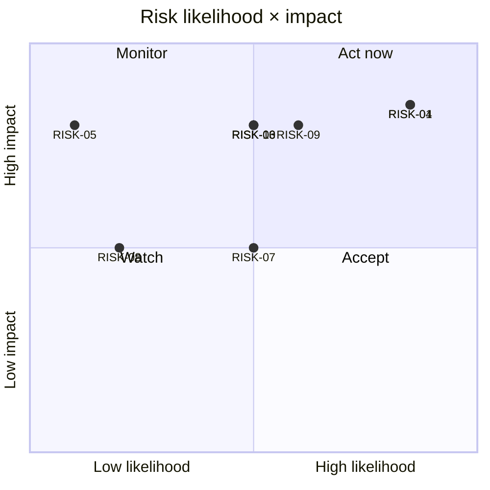

# RiskRegister.md — Statlas Risk Register

| Field | Value |
|---|---|
| Version | v0.1 |
| Last Updated | 2026-08-14 |
| Owner | PM/Founder |
| Status | In Review |

## 1. Risk Matrix

| ID | Risk | Likelihood | Impact | Score (L×I) | Mitigation | Owner | Status |
|---|---|---|---|---|---|---|---|
| RISK-01 | FBref bot-blocks scraping (403) → dataset stuck in `fixture-demo`, production flip blocked | High | High | 9 | Licensed-feed abstraction (StatsSource ABC) → swap source without touching downstream; evaluate proxy/alternate source; documented in production-validation-log.md | Founder | 🔴 Open (BLK-01) |
| RISK-02 | Source HTML/JSON drift (scraper breaks) | Medium | Medium | 4 | Fixture tests per scraper; loud schema-change exceptions; Understat POST fallback already fixed live | Eng | 🟢 Mitigated |
| RISK-03 | StatsBomb license forbids commercial use → shot/event maps can't be monetized | Medium | High | 6 | Coverage-gated UI; derived-metrics posture; **re-verify license before Phase 4 billing**; keep maps free-tier if needed | Founder + lawyer | 🟡 Monitor — hard blocker for Phase 4 monetization |
| RISK-04 | Legal drafts unreviewed → launch blocked / liability | High | High | 9 | Drafts flagged DRAFT; pre-launch-human-actions.md tracked checklist (owner+status) | Founder + lawyer | 🟡 Pending founder action |
| RISK-05 | npm audit false-positive chain in @lhci/cli (extract-zip, no patch) | Resolved | High | — | `overrides`: `@puppeteer/browsers@^3.2.0` + `tmp@^0.2.6`; audit gate green in CI | Eng | 🟢 Closed (a68fb4d) |
| RISK-06 | SQLite/Postgres divergence (enum casts, DDL) | Medium | High | 6 | `native_enum=False` fix; postgres-parity-notes.md; Postgres-verified migrations | Eng | 🟢 Mitigated |
| RISK-07 | Dev-mode e2e flakiness (Turbopack chunk 403s) | Medium | Medium | 4 | e2e runs against **production build**, not dev server | Eng | 🟢 Mitigated |
| RISK-08 | e2e/axe/lint gates regress silently (counts drop) | Low | Medium | 3 | CI compares test counts; axe fails on any violation; Lighthouse failing threshold | Eng | 🟢 Mitigated |
| RISK-09 | Upstream source ToS changes (FBref redistribution) | Medium | High | 6 | Derived-metrics-only policy; swappable source architecture; compliance notes | Founder | 🟡 Monitor |
| RISK-10 | Staging/prod infra absent at launch | Medium | High | 6 | infra-plan.md (hosting, backups, TLS) documented; staging+prod build is a launch prerequisite | Founder | 🟡 Planned, not built |

## 2. Risk Visualization

## 3. Top-3 Watchlist (updated this cycle)

1. **RISK-01** — FBref 403: the only open technical blocker to `production` mode (Tracker BLK-01). Decision needed: licensed feed vs proxy vs alternate source.
2. **RISK-04** — legal: six ⬜ human-action items gate launch (SecurityAndCompliance §6).
3. **RISK-03** — StatsBomb license: re-verification required before any Phase 4 feature monetizes event data.

## 4. Related Documents

| Document | Relationship |
|---|---|
| [PRD.md](PRD.md) | §10 top-3 summary |
| [TechSpec.md](TechSpec.md) | §10 technical risks |
| [AppFlow.md](AppFlow.md) | Risk-affected flows |
| [Design.md](Design.md) | N/A |
| [Schema.md](Schema.md) | RISK-06 data parity |
| [ImplementationPlan.md](ImplementationPlan.md) | RISK-01/03/04 gate Phase 4 |
| [Tracker.md](Tracker.md) | BLK-01 ↔ RISK-01 |
| [Rules.md](Rules.md) | Escalation of risks |
| [API.md](API.md) | N/A |
| [SecurityAndCompliance.md](SecurityAndCompliance.md) | RISK-03/04 detail |
| [Testing.md](Testing.md) | RISK-07/08 mitigations |
| [Deployment.md](Deployment.md) | RISK-10 |
| [Glossary.md](Glossary.md) | Terms |
