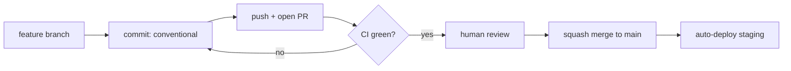

# Rules.md — Statlas Coding Standards & AI-Agent Operating Rules

| Field | Value |
|---|---|
| Version | v0.1 |
| Last Updated | 2026-08-14 |
| Owner | Staff Engineer |
| Status | Approved (mirrors docs/CONSTITUTION.md) |

**This file is the constitution for humans and AI agents.** It extends `docs/CONSTITUTION.md` with engineering-grade operating rules. Violations must be flagged, never silently worked around.

## 1. Guiding Principles

1. **Readability over cleverness** — code is read 10× more than written.
2. **No silent failures** — fail loudly (`FBrefSchemaChangedError`, error states with Retry). Never console-only errors.
3. **Data honesty** — never imply coverage/accuracy that doesn't exist; label recency and dataset mode.
4. **Immutability of history** — never overwrite a snapshot row; version by scrape/computed date.
5. **Small, reviewable PRs** — one logical change per PR; CI must be green before merge.
6. **Accessibility is a gate** — WCAG 2.1 AA, zero axe violations, keyboard-first.
7. **Numbers over adjectives** — state targets as metrics (LCP < 2.5s, p95 < 300ms).
8. **Docs move with code** — schema change ⇒ Schema.md + migration in the same PR (RULE-007).

## 2. Code Style

### Python (backend `app/`)
- **Formatter/linter:** ruff (rules: `F, E4/E7/E9, I, DTZ` — pyproject.toml). Run `ruff check .` before any PR.
- **Naming:** `snake_case` functions/vars; `PascalCase` classes; `SCREAMING_SNAKE` constants.
- **Timezone:** all datetimes timezone-aware UTC (DTZ enforced); convert only at display (docs/engineering/timezone-policy.md).
- **Types:** full type hints (py3.10+ syntax); `from __future__ import annotations` where forward refs needed.
- **DB access:** only via `app/queries/*` — never raw SQL in routes; SQLAlchemy models match `app/schema.sql`.

### TypeScript/React (frontend `web/`)
- **Typecheck:** `npx tsc --noEmit` must pass. No `any` where a type is derivable (project convention: no `any` in lib/).
- **Naming:** `PascalCase` components; `camelCase` functions/vars; kebab-case files.
- **Components:** function components + hooks; no classes. Relative imports within components; `@/` alias for lib.
- **Data fetching:** typed `api.ts` client; never query the DB from components; consume `/api/v1/*` only.
- **Styles:** CSS custom properties from `tokens.css` only — no ad-hoc hex values (RULE-008).

```
app/
├── api/        # FastAPI routes (thin) — delegates to queries
├── queries/    # THE data-access layer (Phase 1 contract)
├── compute/    # percentile/index/anomaly jobs
├── sources/    # scrapers behind StatsSource ABC
├── orchestration/  # weekly_refresh, event_link
web/
├── app/        # Next.js routes (pages + API route handlers/OG)
├── components/ # UI components
├── lib/        # types, api client, chart SVG, share, format
└── styles/     # tokens.css, globals.css
```

## 3. Git Workflow

- **Branch naming:** `feat/<slug>` · `fix/<slug>` · `docs/<slug>` · `chore/<slug>`.
- **Commit format:** Conventional Commits (`feat:`, `fix:`, `test:`, `docs:`, `ci:`, `chore:`), imperative subject ≤ 72 chars, body explains *why*.
- **PR size:** ≤ ~400 lines; split otherwise.
- **Merge strategy:** squash merge to `main`; CI required (5 jobs: python, security, web, e2e, lighthouse).



- **Never:** force-push to `main`, rewrite published history, commit secrets (gitleaks gates), hand-edit lockfiles.

## 4. Testing Requirements

- **Must have tests:** business logic (percentile/index/anomaly math), query-layer contracts, API responses, schema invariants (registry uniqueness — test_matrix_validation.py), scraper parsers (fixture data, no live network).
- **Should have:** e2e for radar generation + search/filter (Playwright); axe on 4 core pages; breakpoint no-overflow matrix.
- **Coverage target:** no formal % gate; the bar is "every new function with non-trivial logic gets a test" + CI counts must never drop (compare counts, not just pass/fail).
- **Full strategy:** [Testing.md](Testing.md).

## 5. AI Agent Operating Rules (imperative)

1. Read **Tracker.md** and **ImplementationPlan.md** before starting any task. Never pick a task that isn't in the tracker.
2. Never mark a task 🟢 Done in Tracker.md without its tests passing.
3. Never invent requirements not present in PRD.md/TechSpec.md — if ambiguous, flag it (RULE-011 escalation) instead of guessing silently.
4. Always update Schema.md (and add a migration) when a change touches the data model — same PR.
5. Never commit secrets/keys; use environment variables per SecurityAndCompliance.md §4.
6. Always cross-check Design.md + tokens.css before building or restyling UI components.
7. When a rule conflicts with a user request, state the conflict explicitly rather than silently choosing one.
8. Run the full verification set before declaring done: `pytest -q`, `ruff check .`, `npx tsc --noEmit`, relevant `node --test` + Playwright specs.
9. Never rewrite applied migrations or hand-edit package-lock files.
10. Do not "fix" bugs silently during cleanup work — flag them (Rules §9 escalation) unless explicitly authorized.

## 6. Security Baseline Rules

- Input validation on every API param (Pydantic/query validators); no raw SQL string concatenation.
- Secrets only via env vars; `.env` gitignored; gitleaks + `pip-audit` + `npm audit --audit-level=high` enforced in CI.
- Dependency upgrades: minor/patch via dependabot; major versions require compatibility verification before merge.
- No debug/admin endpoints without auth in production (v1 has no auth surfaces — revisit at Phase 4).
- Full detail: [SecurityAndCompliance.md](SecurityAndCompliance.md).

## 7. Documentation Rules

- Any schema change ⇒ same-PR update to Schema.md §2/§4/§7 + migration file.
- Any new endpoint ⇒ API.md updated in the same PR.
- Any behavior change ⇒ PRD/Tracker status updated.
- Any new REQ ⇒ added to PRD.md §6 with a unique `REQ-###` and Tracker row.
- DoD (global checklist): see ImplementationPlan.md §7.

## 8. Prohibited Patterns

| Anti-pattern | Why |
|---|---|
| `pytest.raises(Exception)` blind catches | Masks real bugs (fixed in closeout) |
| Silent `except: pass` on scrapers | Violates fail-loudly (Principle 2) |
| Naive `date.today()` in backend | Timezone policy (DTZ lint) |
| Color-only data encoding | A11y violation (Constitution) |
| "TBD" without owner+deadline in docs | Orphan ambiguity |
| Hardcoded metric weights in code | Must live in metric_registry.json |
| Updating snapshot rows in place | Breaks immutability (Principle 4) |
| Fabricated stats/lorem copy in shipped pages | Credibility killer (Constitution §7) |

## 9. Escalation Rules

**Stop and ask a human when:**
- A request conflicts with these rules or the Constitution.
- A change touches auth, payments, migrations, or public API contracts.
- A real bug is discovered mid-cleanup (don't silently fix).
- Removing something whose consumers live outside the repo (infra, external consumers).
- Legal/compliance questions arise (ToS, StatsBomb license, trademark).

**Decide autonomously when:**
- Tier 0/1 mechanical cleanup (unused imports, dead CSS, debug leftovers) per the cleanup-audit methodology.
- Test/refactor work fully covered by the suite.
- Doc updates that don't change contracts.

## 10. Related Documents

| Document | Relationship |
|---|---|
| [PRD.md](PRD.md) | Requirements this ruleset governs |
| [TechSpec.md](TechSpec.md) | Technical constraints (NFRs) |
| [AppFlow.md](AppFlow.md) | A11y rules apply to every screen |
| [Design.md](Design.md) | RULE-006/008 targets |
| [Schema.md](Schema.md) | RULE-004/007 targets |
| [ImplementationPlan.md](ImplementationPlan.md) | DoD checklist §7 |
| [Tracker.md](Tracker.md) | RULE-001/002 targets |
| [API.md](API.md) | RULE: endpoint docs sync |
| [SecurityAndCompliance.md](SecurityAndCompliance.md) | §6 full security baseline |
| [Testing.md](Testing.md) | §4 test requirements detail |
| [Deployment.md](Deployment.md) | CI gates referenced in §3 |
| [Glossary.md](Glossary.md) | Shared vocabulary |
| [RiskRegister.md](RiskRegister.md) | Escalation-relevant risks |
