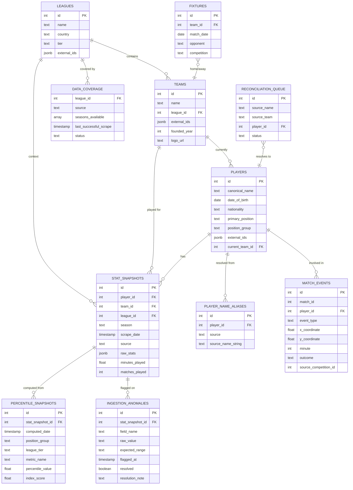

# Schema.md — Statlas Data Model & Database Design

| Field | Value |
|---|---|
| Version | v0.1 |
| Last Updated | 2026-08-14 |
| Owner | Staff Engineer (data) |
| Status | In Review |

Source of truth: `app/schema.sql` (DDL) + SQLAlchemy models in `app/models.py`. This doc mirrors both; any change must land in all three (Rules.md RULE-007).

## 1. ER Diagram



## 2. Table Definitions

### TBL-leagues
| Field | Type | Nullable | Default | Constraints | Description |
|---|---|---|---|---|---|
| id | int | No | auto | PK | |
| name | text | No | — | unique | "Premier League" |
| country | text | Yes | — | | |
| tier | text | No | — | enum: `top-5` / `second-tier` / `other` | Grouping key for percentiles |
| external_ids | jsonb | Yes | — | | FBref/Understat identifiers |

### TBL-teams
| Field | Type | Nullable | Default | Constraints | Description |
|---|---|---|---|---|---|
| id | int | No | auto | PK | |
| name | text | No | — | | |
| league_id | int | No | — | FK → leagues.id | |
| external_ids | jsonb | Yes | — | | per-source ids |
| founded_year | int | Yes | — | | |
| logo_url | text | Yes | NULL | | NULL until real licensed asset — UI shows honest placeholder |

### TBL-players
| Field | Type | Nullable | Default | Constraints | Description |
|---|---|---|---|---|---|
| id | int | No | auto | PK | |
| canonical_name | text | No | — | | |
| date_of_birth | date | Yes | — | | age computed from this, never hardcoded |
| nationality | text | Yes | — | | |
| primary_position | text | Yes | — | | e.g. "LW" |
| position_group | text | No | — | enum: `GK/CB/FB/DM/CM/AM/W/ST` | Cohort key |
| external_ids | jsonb | Yes | — | | per-source ids |
| current_team_id | int | Yes | NULL | FK → teams.id | NULL = free agent |

### TBL-player_name_aliases
| Field | Type | Nullable | Default | Constraints | Description |
|---|---|---|---|---|---|
| id | int | No | auto | PK | |
| player_id | int | No | — | FK → players.id | |
| source | text | No | — | enum: `fbref/understat/statsbomb` | |
| source_name_string | text | No | — | | exact source spelling; drives alias search (US-001) |

### TBL-stat_snapshots
| Field | Type | Nullable | Default | Constraints | Description |
|---|---|---|---|---|---|
| id | int | No | auto | PK | |
| player_id | int | No | — | FK → players.id; index | |
| team_id | int | Yes | — | FK → teams.id | |
| league_id | int | Yes | — | FK → leagues.id; index | |
| season | text | No | — | | e.g. "2025-2026" |
| scrape_date | timestamp | No | — | **versioning key**; unique with (player, source, season) | Constitution immutability |
| source | text | No | — | enum: `fbref/understat/statsbomb/api_football` | |
| raw_stats | jsonb | No | — | | every per-90 metric from that scrape |
| minutes_played | float | No | — | ≥ 0 | qualifying threshold basis |
| matches_played | int | No | — | ≥ 0 | |

### TBL-percentile_snapshots
| Field | Type | Nullable | Default | Constraints | Description |
|---|---|---|---|---|---|
| id | int | No | auto | PK | |
| stat_snapshot_id | int | No | — | FK → stat_snapshots.id | |
| computed_date | timestamp | No | — | | run version |
| position_group | text | No | — | enum | cohort |
| league_tier | text | No | — | enum: top-5/second-tier/other | **tier dimension** (closeout C1 gate — cross-tier transfers don't collide) |
| metric_name | text | No | — | unique per (snapshot, position_group, league_tier, metric) | |
| percentile_value | float | No | — | 0–100 | |
| index_score | float | Yes | NULL | | Statlas Index, only for qualifying players |

### TBL-match_events
| Field | Type | Nullable | Default | Constraints | Description |
|---|---|---|---|---|---|
| id | int | No | auto | PK | |
| match_id | int | No | — | index | StatsBomb match id |
| player_id | int | Yes | — | FK → players.id; NULL if unmatched | |
| event_type | text | No | — | enum: `shot/pass/...` | |
| x_coordinate / y_coordinate | float | No | — | | normalized 0–1 pitch coords |
| minute | int | Yes | — | | |
| outcome | text | Yes | — | | e.g. goal/blocked |
| source_competition_id | int | No | — | | |

### TBL-data_coverage
| Field | Type | Nullable | Default | Constraints | Description |
|---|---|---|---|---|---|
| league_id | int | No | — | FK → leagues.id; PK part | |
| source | text | No | — | PK part; enum | |
| seasons_available | array | Yes | — | | |
| last_successful_scrape | timestamp | Yes | — | | |
| status | text | No | — | enum: `active/stale/failed` | powers coverage-gated UI (REQ-012) |

### TBL-ingestion_anomalies
| Field | Type | Nullable | Default | Constraints | Description |
|---|---|---|---|---|---|
| id | int | No | auto | PK | |
| stat_snapshot_id | int | No | — | FK → stat_snapshots.id | |
| field_name | text | No | — | | e.g. `pass_pct` |
| raw_value | text | No | — | | value that failed bounds |
| expected_range | text | No | — | | |
| flagged_at | timestamp | No | — | | |
| resolved | boolean | No | false | | publish blocked until resolved |
| resolution_note | text | Yes | — | | |

### TBL-reconciliation_queue
| Field | Type | Nullable | Default | Constraints | Description |
|---|---|---|---|---|---|
| id | int | No | auto | PK | |
| source_name | text | No | — | | unmatched name |
| source_team | text | Yes | — | | disambiguation context |
| player_id | int | Yes | — | FK → players.id | set when manually resolved |
| status | text | No | — | enum: `pending/resolved` | |

### TBL-fixtures
| Field | Type | Nullable | Default | Constraints | Description |
|---|---|---|---|---|---|
| id | int | No | auto | PK | |
| team_id | int | No | — | FK → teams.id | API-Football fixture sync |
| match_date | date | No | — | | |
| opponent | text | Yes | — | | |
| competition | text | Yes | — | | |

## 3. Relationships & Foreign Keys

| From | To | On delete | Justification |
|---|---|---|---|
| teams.league_id | leagues.id | RESTRICT | never orphan teams |
| players.current_team_id | teams.id | SET NULL | free agents stay in system |
| player_name_aliases.player_id | players.id | CASCADE | aliases die with player |
| stat_snapshots.player_id | players.id | CASCADE | history dies with player |
| stat_snapshots.team_id | teams.id | SET NULL | team deletion keeps stats |
| stat_snapshots.league_id | leagues.id | RESTRICT | league context must exist |
| percentile_snapshots.stat_snapshot_id | stat_snapshots.id | CASCADE | percentiles are children of a scrape |
| match_events.player_id | players.id | SET NULL | unmatched events preserved |
| data_coverage.league_id | leagues.id | CASCADE | coverage dies with league |
| ingestion_anomalies.stat_snapshot_id | stat_snapshots.id | CASCADE | anomalies die with snapshot |
| reconciliation_queue.player_id | players.id | SET NULL | unresolved rows stay |
| fixtures.team_id | teams.id | CASCADE | fixtures die with team |

## 4. Indexes

| Table | Index | Columns | Type | Reason |
|---|---|---|---|---|
| stat_snapshots | idx_snap_player | player_id | btree | profile queries |
| stat_snapshots | idx_snap_league | league_id | btree | leaderboards |
| stat_snapshots | idx_snap_scrape | scrape_date | btree | latest-snapshot lookups |
| stat_snapshots | uq_snap_version | player_id, source, season | unique | idempotency (Constitution) |
| percentile_snapshots | idx_pct_cohort | position_group, league_tier, metric_name | btree | cohort percentile computation |
| percentile_snapshots | uq_pct_slot | stat_snapshot_id, position_group, league_tier, metric_name | unique | closeout C1 tier-completeness gate |
| match_events | idx_events_player | player_id | btree | event maps |
| players | idx_players_name | canonical_name | btree | search |
| data_coverage | PK | league_id, source | unique | coverage lookups |
| ingestion_anomalies | idx_anom_unresolved | resolved | partial | queue listing |

## 5. Enums / Constants

| Field | Allowed values | Where defined |
|---|---|---|
| leagues.tier | `top-5`, `second-tier`, `other` | config/tiers.json |
| players.position_group | `GK`, `CB`, `FB`, `DM`, `CM`, `AM`, `W`, `ST` | methodology.md §index |
| stat_snapshots.source | `fbref`, `understat`, `statsbomb`, `api_football` | schema.sql + models.py |
| data_coverage.status | `active`, `stale`, `failed` | schema.sql |
| metric ids (16) | `si_gls_p90`, `si_xg_p90`, `si_sh_p90`, `si_prgp_p90`, `si_prgc_p90`, `si_xag_p90`, `si_kp_p90`, `si_tkl_p90`, … | config/metric_registry.json |
| qualifying_minutes | `900` | metric_registry.json |

## 6. Data Lifecycle

- **Immutable core:** `stat_snapshots` and `percentile_snapshots` are **never updated** — each weekly run inserts new rows (versioned by `scrape_date`/`computed_date`). Historical percentiles never reflow (percentile-rules.md).
- **Retention:** no hard-delete policy yet — TBD, owner: Founder, resolve by: Phase 4 (data is small pre-launch; revisit with paid storage).
- **Soft vs hard delete:** no soft-delete columns; deletes are hard but rare (cascade rules above). Reconciliation/aliases are additive (auditable).
- **Anomaly lifecycle:** flagged → resolved/overridden → snapshot publishable; unresolved rows remain queryable as flags.

## 7. Migrations Strategy

- **Tool:** SQLAlchemy + raw SQL migration files in `scripts/migrations/` (e.g., `001_percentile_tier_key.sql`).
- **Naming:** zero-padded sequence + snake_case description.
- **Rollback:** each migration documents its reverse; roll forward preferred (data-safe), never edit applied migrations (Rules.md RULE-009).
- **Parity:** migrations verified on Postgres 17 (postgres-parity-notes.md), run on SQLite for tests via models.

## 8. Sample Records

```json
{
  "players": { "id": 42, "canonical_name": "Mohamed Salah", "position_group": "W", "current_team_id": 7 },
  "player_name_aliases": { "player_id": 42, "source": "fbref", "source_name_string": "Mohamed Salah" },
  "stat_snapshots": { "player_id": 42, "season": "2025-2026", "source": "fbref", "scrape_date": "2026-07-29T00:00:00Z", "raw_stats": { "si_gls_p90": 0.72, "si_xg_p90": 0.61 }, "minutes_played": 2520, "matches_played": 28 },
  "percentile_snapshots": { "stat_snapshot_id": 901, "position_group": "W", "league_tier": "top-5", "metric_name": "si_gls_p90", "percentile_value": 94.2, "index_score": 81.4 }
}
```

## 9. Data Validation Rules

| Field | Rule | Enforced at |
|---|---|---|
| minutes_played | ≥ 0 | DB check + anomaly_check |
| pass completion | 0–100 | anomaly_check (bounds) |
| percentile_value | 0–100 | compute + DB |
| raw_stats keys | must match registry metric ids | test_matrix_validation.py (§3 CI gate) |
| index_score | present iff qualifying (≥900 min) | compute + tests |
| rate limits | per-source delay config | settings + compliance notes |

## 10. Sensitive Data Map

| Field | Sensitivity | Encrypted at rest? | Masked in logs? |
|---|---|---|---|
| players.date_of_birth | PII (indirect) | No (DB-level) | Yes — never logged |
| players.nationality | none (public fact) | No | n/a |
| all other fields | none | No | n/a |
| POSTGRES_PASSWORD / API keys | secret | env only | never logged (gitleaks CI) |

No payment, email, or auth data exists in v1 (Phase 4 adds accounts/billing — revisit this map then; SecurityAndCompliance.md §6).

## 11. Related Documents

| Document | Relationship |
|---|---|
| [PRD.md](PRD.md) | REQ-005/012 depend on snapshot/coverage tables |
| [TechSpec.md](TechSpec.md) | Query layer consumes these tables |
| [AppFlow.md](AppFlow.md) | Screens render these entities |
| [Design.md](Design.md) | N/A |
| [ImplementationPlan.md](ImplementationPlan.md) | TBL references in tasks |
| [Tracker.md](Tracker.md) | Schema status |
| [Rules.md](Rules.md) | RULE-007/009 schema-change rules |
| [API.md](API.md) | Endpoints touching each table |
| [SecurityAndCompliance.md](SecurityAndCompliance.md) | §10 sensitive-data policy |
| [Testing.md](Testing.md) | Fixture data mirrors these rows |
| [Deployment.md](Deployment.md) | Migrations run at deploy |
| [Glossary.md](Glossary.md) | Tier, cohort, snapshot terms |
| [RiskRegister.md](RiskRegister.md) | Data-parity risks |
