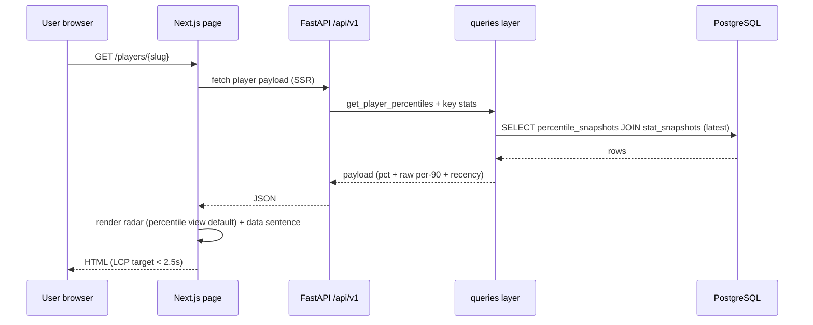
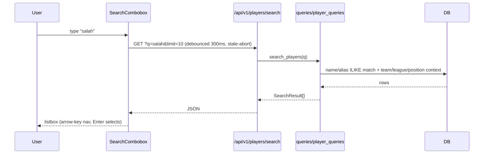

# TechSpec.md — Statlas Technical Specification

| Field | Value |
|---|---|
| Version | v0.1 |
| Last Updated | 2026-08-14 |
| Owner | Staff Engineer |
| Status | In Review |

## 1. Architecture Overview

```mermaid
graph TD
    subgraph Client["Web (Next.js 16, SSR + client components)"]
        P[Pages: /compare, /players/[slug], /clubs/..., /leagues/..., /methodology]
        C[Components: RadarChart, TrendChart, SearchCombobox, ShotMap, ...]
        L[lib/: api.ts, share.ts, chartSvg.ts, radar.ts, trend.ts]
    end

    subgraph API["FastAPI app.api.main (uvicorn :8000)"]
        R[Router: /api/v1/*]
        Q[Query layer: app/queries/*]
    end

    subgraph Data["Storage"]
        DB[(PostgreSQL prod / SQLite dev)]
        MATRIX[data/coverage_matrix.json]
        REG[config/metric_registry.json + tiers.json]
    end

    subgraph Ext["External sources"]
        FB[FBref]
        UN[Understat]
        SB[StatsBomb Open Data GitHub]
        AF[API-Football]
    end

    P -->|fetch via NEXT_PUBLIC_STATLAS_API_URL| R
    R --> Q
    Q --> DB
    R --> MATRIX
    R --> REG
    Q -->|coverage gating| MATRIX

    S[Scrapers: sources/*.py] -->|rate-limited HTTP| FB
    S -->|embedded JSON / POST| UN
    S -->|GitHub JSON| SB
    S -->|free-tier budget| AF
    S --> DB
    C[compute/*.py + orchestration/weekly_refresh.py] --> DB
```

Pattern: **layered monolith** — FastAPI backend (routes → query layer → ORM), Next.js frontend (SSR pages → client components → typed fetch client), scheduled jobs for ingestion/computation. Evidence: `app/api/main.py` delegates to `app/queries/*` (`_with_session` pattern); UI consumes only API routes (PRD §9 dependency rule).

## 2. Tech Stack Table

| Layer | Technology | Version | Justification |
|---|---|---|---|
| Web framework | Next.js (App Router) | 16.3.0 | SSR/SSG for SEO profile pages; RSC; OG image routes; standalone Docker output |
| UI | React | 19.2.8 | Matches Next 16; client components for radar/search |
| Charts | Custom SVG (no chart lib) | — | Radar/trend axes must be selectable text (Constitution), not canvas; full control over a11y + OG rendering |
| Icons | lucide-react | ^0.x | Lightweight, tree-shaken |
| API | FastAPI + uvicorn | 0.139.2 / ≥0.29 | Typed responses via Pydantic; async-ready; auto OpenAPI |
| ORM | SQLAlchemy 2.x | 2.0.46 | Declarative models matching `app/schema.sql`; SQLite dev / Postgres prod parity verified |
| DB | PostgreSQL (prod) / SQLite (dev, tests) | 17 / stdlib | Postgres parity documented (docs/engineering/postgres-parity-notes.md) |
| Scraping | requests + BeautifulSoup | ≥2.31 / ≥4.12 | Table parsing (FBref), embedded JSON (Understat) |
| Testing (py) | pytest + httpx TestClient | ≥8.0 / ≥0.27 | 104 tests; fixture-based scrapers (no live network in tests) |
| Testing (web) | Playwright + @axe-core/playwright + node --test | ^1.x | e2e (radar/search), breakpoint matrix, axe audits; unit tests for lib |
| Perf gate | @lhci/cli (Lighthouse CI) | 0.15.1 | Enforced LCP < 2.5s in CI |
| Lint (py) | ruff | ≥0.6 | F, E4/E7/E9, I, DTZ enforced (timezone policy) |
| Lint (web) | tsc --noEmit (no ESLint) | — | See Rules.md RULE-012: ESLint gate intentionally absent |
| Security scan | gitleaks + pip-audit + npm audit | — | CI-enforced (see SecurityAndCompliance.md §4) |
| CI | GitHub Actions | — | 5 jobs: python, security, web, e2e, lighthouse |
| Runtime | Docker Compose (db/api/web/seed) + standalone web image | — | Deployment.md §2 |

## 3. System Components

### 3.1 Next.js web app (`web/`)
- **Responsibility:** SSR profile/leaderboard pages + client-side radar tool, share/embed, OG images.
- **Inputs:** `NEXT_PUBLIC_STATLAS_API_URL`, `NEXT_PUBLIC_SITE_URL`; API JSON.
- **Outputs:** HTML (SSR), client-side fetched JSON, SVG charts, OG PNG via `route.tsx`.
- **Scaling:** stateless; static pages for /methodology, /pricing; SSR for dynamic. Standalone output for Docker.
- **Failure modes:** API down → state blocks with retry (REQ-005); SSR fetch failure → error boundary/state (AppFlow.md §4).

### 3.2 FastAPI API (`app/api/main.py` + views)
- **Responsibility:** thin HTTP layer over `app/queries/*`; serves health/meta/leagues/leaderboard/players/search/events/coverage/positions/methodology.
- **Failure modes:** DB unreachable → 500 with JSON error; `_with_session` per-request session lifecycle.

### 3.3 Query layer (`app/queries/*.py`)
- **Responsibility:** the only data-access path (Phase 1 contract): `player_queries`, `leaderboard_queries`, `coverage_queries`, `trend_queries`, `event_queries`, `similar_players`, `sentences`, `league_queries`, `team_queries`.
- **Key rule:** percentiles come from `percentile_snapshots` (immutable rows); never recomputed at read time.

### 3.4 Sources + ingestion (`app/sources/*.py`, `app/reconciliation.py`)
- Shared `StatsSource` ABC (`base.py`): `fetch_league_stats`, `get_source_name`, `get_rate_limit_seconds`. Implementations: FBref, Understat, StatsBomb, API-Football (budget-tracked).
- Rate limits (from `data-compliance-notes.md`): FBref 10s+2s jitter; Understat 5s; API-Football 2s + 80/day budget. Real request timing logged during validation (production-validation-log.md).

### 3.5 Compute + orchestration (`app/compute/*.py`, `app/orchestration/*.py`)
- `percentiles.py` (per-league-tier cohorts, 900-min floor), `index.py` (weighted composite from `metric_registry.json`), `anomaly_check.py` (bounds checks; violations → `ingestion_anomalies`).
- `weekly_refresh.py`: scrape → reconcile → anomaly-check → percentile-compute → index-compute → mark-published. Idempotent (scrape_date + source natural key).
- `event_link.py`: matches StatsBomb events to players, writing `data_coverage`.

### 3.6 Database
- 11 tables (Schema.md §2). Immutable `stat_snapshots`/`percentile_snapshots` (never overwrite — Constitution).

## 4. Data Flow Diagrams





```mermaid
sequenceDiagram
    participant J as weekly_refresh job
    participant S as Sources
    participant DB as DB
    participant C as compute
    participant AN as anomaly_check

    J->>S: fetch_league_stats(league, season)
    S-->>J: RawPlayerStatRecord[]
    J->>DB: reconcile names (reconciliation.py) → insert stat_snapshots
    J->>AN: run bounds checks
    AN-->>J: violations (write ingestion_anomalies; require resolution)
    J->>C: compute percentiles (per league-tier cohort)
    J->>C: compute index (weights from registry)
    J->>DB: insert percentile_snapshots rows (immutable, unique on snapshot)
    Note over J,DB: idempotent: re-run for same scrape_date+source upserts, no dupes
```

## 5. Third-Party Integrations

| Service | Purpose | Failure fallback | Cost model | Rate limits |
|---|---|---|---|---|
| FBref | Primary per-90 stats (all metric groups) | Loud `FBrefSchemaChangedError` on drift; dataset stays fixture-demo | Free (no redistribution license → derived metrics only) | Self-imposed 10s + 2s jitter |
| Understat | xG/xA/shot data, Big-5 | Fallback to new POST endpoint if embedded JSON absent (real-world drift fixed) | Free | 5s self-imposed |
| StatsBomb Open Data | Event-level shots/passes/matches | Coverage-gated UI hides maps when absent | Free, **bespoke user agreement — non-commercial; §1.2.2 bans commercial exploitation of data/derived analysis** — resolution required before monetization (data-compliance-notes.md §3) | GitHub API pulls; cached |
| API-Football | Fixtures for trend annotations | Budget tracker stops calls near daily quota (80/100) | Free tier 100 req/day | 2s + daily budget |
| GitHub Actions | CI/CD | — | Free public minutes | — |

## 6. Non-Functional Requirements

| Category | Requirement | Target metric | How verified |
|---|---|---|---|
| Performance | LCP on SSR profiles | < 2.5s p75 | Lighthouse CI (failing threshold enforced) |
| Performance | Radar client render | No jank on 4-player radar | Playwright + manual; static SVG |
| Availability | API health | `/api/v1/health` 200 | CI smoke; startup_flow doc |
| Scalability | Concurrent SSR | 10k users (12-mo estimate) | Stateless web; standalone Docker |
| Security | Secrets | Zero hardcoded | gitleaks CI + audit gates |
| Observability | Logs + structured | uvicorn access logs; STATLAS_LOG_LEVEL | Config-driven |
| Accessibility | WCAG 2.1 AA | 0 axe violations on core pages | @axe-core/playwright CI |
| Integrity | Immutable snapshots | No updates to stat/percentile rows | Schema constraints + tests |
| Data honesty | Coverage gating | No false "available" badges | test_matrix_validation.py + UI tests |

## 7. Environments

| Env | URL | Data policy | Deploy trigger | Access |
|---|---|---|---|---|
| Dev (local) | `127.0.0.1:3000` / `:8000` | SQLite `data/dev.db` seeded fixture-demo | Manual `npm run dev` + uvicorn | Local only |
| CI | ephemeral | Fresh seed per run | Every push/PR | GitHub runners |
| Staging | `staging.statlas.com` (planned, not built) | Postgres staging clone | Manual promote | Founder + team (see infra-plan.md) |
| Prod | `statlas.com` (planned) | Postgres; production dataset | CI green → deploy | Public |

## 8. Error Handling Strategy

- **API:** JSON error bodies; `value_error_handler` for validation; HTTP 4xx/5xx with clear `detail`.
- **Frontend:** typed `ApiError` in `web/lib/api.ts`; per-component error states with Retry (state-block--error). No console-only failures.
- **Scrapers:** fail loudly on schema drift (`FBrefSchemaChangedError`, `UnderstatSchemaChangedError`); never silently return partial data.
- **Idempotency:** scrape_date + source unique key; anomaly resolution required before publish.
- **Retry/backoff:** exponential backoff in sources with bounded `backoff_delays` (real-world infinite-loop bug fixed during validation).

## 9. Observability

- **Logs:** uvicorn access logs; `STATLAS_LOG_LEVEL` (default INFO); scraper request timing logged during validation runs.
- **Metrics:** Lighthouse CI scores persisted in `lhci-reports/`; test counts in CI output.
- **Dashboards:** none yet (pre-launch); infra-plan.md documents the plan (Grafana/pg metrics) for Phase 4.
- **Alert thresholds (planned):** CI red = alert; LCP regression > 10% = investigate.

## 10. Technical Risks & Mitigations

| Risk | Mitigation |
|---|---|
| FBref 403 blocking | Licensed-feed abstraction (StatsSource ABC) → swap source without touching downstream; see RiskRegister.md RISK-01 |
| Source HTML drift | Fixture tests + loud schema-change exceptions; Understat POST fallback |
| SQLite/Postgres divergence | `native_enum=False` fix verified; postgres-parity-notes.md; CI runs Postgres for parity checks |
| Dev-mode e2e flakiness | e2e runs against **production build** (`npm run build` + `npm run start`), not dev mode |
| npm audit false-positive chain | `overrides` pin patched `@puppeteer/browsers@^3.2.0` + `tmp@^0.2.6` (see RiskRegister.md RISK-05) |

## 11. Related Documents

| Document | Relationship |
|---|---|
| [PRD.md](PRD.md) | What is built (REQ IDs) |
| [AppFlow.md](AppFlow.md) | Screens consuming these components |
| [Design.md](Design.md) | Tokens/CSS referenced by components |
| [Schema.md](Schema.md) | The `DB` node above; every query maps to tables here |
| [API.md](API.md) | The `R` node: endpoints, contracts, error codes |
| [ImplementationPlan.md](ImplementationPlan.md) | Build tasks for each component |
| [Tracker.md](Tracker.md) | Status of system components |
| [Rules.md](Rules.md) | Conventions every engineer/AI agent follows |
| [SecurityAndCompliance.md](SecurityAndCompliance.md) | NFR security row detail |
| [Testing.md](Testing.md) | How components are verified |
| [Deployment.md](Deployment.md) | Environments + CI/CD pipeline |
| [Glossary.md](Glossary.md) | Terms (PAdj, percentile, Statlas Index) |
| [RiskRegister.md](RiskRegister.md) | RISK-01…05 detail |
