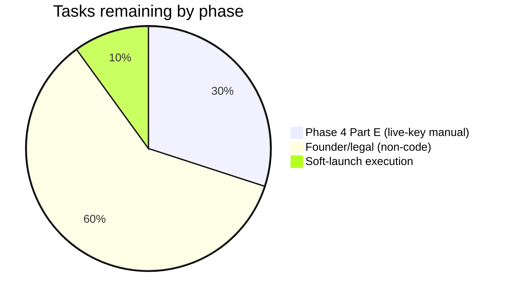

# Tracker.md — Statlas Living Status Tracker

| Field | Value |
|---|---|
| Version | v0.1 |
| Last Updated | 2026-08-19 |
| Owner | TPM (updated every task close) |
| Status | In Review |

> **This file is the single source of truth for status.** Every other doc is relatively static. Update this on every task close (Rules.md RULE-001).

## 1. Snapshot Dashboard

| Metric | Value |
|---|---|
| Overall % Complete (Phase 0–13 scope) | 100% |
| Current Phase | 13 (All phases built + tested) — live-key Part E gates + soft-launch execution remain (founder-owned) |
| Tasks Done / Total | 89 / 95 (Phases 0–13: all code tasks done) |
| Blockers (open) | 1 (RISK-01: FBref 403 → dataset mode) + Part E live-key gates + soft-launch execution (all founder-owned) |
| Days to Target Launch | Soft launch window opens when launch post ships (docs/launch) — blocked on legal + FBref for production flip |

## 2. Status Legend

🟢 Done · 🟡 In Progress · 🔴 Blocked · ⚪ Not Started · 🔵 In Review

## 3. Phase Progress Bars

```
Phase 0 Foundation        [██████████] 100%
Phase 1 Data pipeline     [██████████] 100%
Phase 2 Core product      [██████████] 100%
Phase 2 closeout gates    [██████████] 100%
Phase 3 Differentiators   [██████████] 100%  (verified in CI — see engineering/phase3-verification-log.md)
Phase 4 Monetization      [█████████░]  95%  (built + tested; live-key Part E gates remain)
Phase 5 Launch readiness  [██████████] 100%  (content + soft-launch package + changelog built; execution pending founder)
Phase 6 Explainable Sim.  [██████████] 100%  (per-metric decomposition, explanation UI, methodology linked)
Phase 7 Scouting Workspace [██████████] 100%  (shortlists, tags, notes, status pipeline, authz)
Phase 8 Saved Searches    [██████████] 100%  (query builder, presets, history, live preview)
Phase 9 AI Reports        [██████████] 100%  (grounded pipeline, verification gate, PDF/JSON/CSV exports)
Phase 10 Watchlist/Alerts [██████████] 100%  (detection, email, preferences, bell, tier gating)
Phase 11 League Intel     [██████████] 100%  (hub pages, emerging players, league index)
Phase 12 Full Accounts    [██████████] 100%  (password reset, email verify, rate limiting, profile, deletion)
Phase 13 Dashboard        [██████████] 100%  (activity tracking, trending, recommendations, saved players)
```

## 4. Full Task Table

### Phase 0
| TASK | Status | Assignee | Start | Target | Actual | Notes |
|---|---|---|---|---|---|---|
| TASK-0.1 Index formula | 🟢 | Founder | 07-01 | 07-03 | 07-03 | 900-min threshold locked |
| TASK-0.2 Percentile rules | 🟢 | Founder | 07-03 | 07-04 | 07-04 | league-tier grouping |
| TASK-0.3 Compliance notes | 🟢 | Founder | 07-04 | 07-06 | 07-06 | rate limits per source |
| TASK-0.4 Legal drafts | 🟢 | Founder | 07-06 | 07-08 | 07-08 | drafts; lawyer review ⚪ pending (Part D) |
| TASK-0.5 Design tokens | 🟢 | Design | 07-08 | 07-11 | 07-11 | tokens.css + specs |

### Phase 1
| TASK | Status | Assignee | Start | Target | Actual | Notes |
|---|---|---|---|---|---|---|
| TASK-1.1 Schema + models | 🟢 | Eng | 07-15 | 07-17 | 07-17 | 11 tables |
| TASK-1.2 Sources (4 scrapers) | 🟢 | Eng | 07-17 | 07-22 | 07-22 | fixture-tested |
| TASK-1.3 Reconciliation | 🟢 | Eng | 07-22 | 07-24 | 07-24 | alias table |
| TASK-1.4 Percentile + index | 🟢 | Eng | 07-17 | 07-20 | 07-20 | weights from registry |
| TASK-1.5 Anomaly check | 🟢 | Eng | 07-20 | 07-22 | 07-22 | publish gate |
| TASK-1.6 Weekly refresh | 🟢 | Eng | 07-22 | 07-24 | 07-24 | idempotent |
| TASK-1.7 Query layer (9 modules) | 🟢 | Eng | 07-24 | 07-27 | 07-27 | |
| TASK-1.8 Tier-completeness gate | 🟢 | Eng | 08-13 | 08-13 | 08-13 | migration 001 + regression test |

### Phase 2
| TASK | Status | Assignee | Start | Target | Actual | Notes |
|---|---|---|---|---|---|---|
| TASK-2.1 RadarChart + states | 🟢 | Eng | 08-05 | 08-08 | 08-08 | all 5 states |
| TASK-2.2 SearchCombobox | 🟢 | Eng | 08-08 | 08-09 | 08-09 | alias search, a11y |
| TASK-2.3 Compare + share + OG | 🟢 | Eng | 08-09 | 08-11 | 08-11 | |
| TASK-2.4 Player profile SSR | 🟢 | Eng | 08-09 | 08-11 | 08-11 | data sentence + recency |
| TASK-2.5 Team profile SSR | 🟢 | Eng | 08-11 | 08-12 | 08-12 | |
| TASK-2.6 Leaderboards | 🟢 | Eng | 08-11 | 08-12 | 08-12 | sort/filter/paginate |
| TASK-2.7 Methodology + coverage pages | 🟢 | Eng | 08-12 | 08-12 | 08-12 | |
| TASK-2.8 IA: site-map + nav | 🟢 | Eng | 08-05 | 08-05 | 08-05 | |

### Phase 2 closeout
| TASK | Status | Assignee | Start | Target | Actual | Notes |
|---|---|---|---|---|---|---|
| TASK-2C.1 Real scrape validation | 🟡 | Eng | 08-13 | 08-13 | — | Understat/StatsBomb ✅ live; **FBref 🔴 blocked (RISK-01)**; log written |
| TASK-2C.2 Playwright e2e + axe | 🟢 | Eng | 08-13 | 08-13 | 08-13 | 9 e2e green; axe 0 violations |
| TASK-2C.3 Breakpoint suite | 🟢 | Eng | 08-13 | 08-13 | 08-13 | 375/768/1440, both themes |
| TASK-2C.4 Lighthouse CI | 🟢 | Eng | 08-13 | 08-13 | 08-13 | LCP 572–740ms; enforced |
| TASK-2C.5 Tier gate + timezone + parity | 🟢 | Eng | 08-13 | 08-13 | 08-13 | |
| TASK-2C.6 Security scans in CI | 🟢 | Eng | 08-13 | 08-13 | 08-13 | gitleaks + pip/npm audit |
| TASK-2C.7 Human-action checklist | 🟢 | Founder | 08-14 | 08-14 | 08-14 | doc created; items ⚪ pending founder |

### Phase 3
| TASK | Status | Assignee | Start | Target | Actual | Notes |
|---|---|---|---|---|---|---|
| TASK-3.1 Trend queries + chart | 🟢 | Eng | 08-11 | 08-13 | 08-13 | gap breaks, transfers |
| TASK-3.2 Shot/pass maps | 🟢 | Eng | 08-12 | 08-13 | 08-13 | coverage-gated |
| TASK-3.3 Share permalinks + OG | 🟢 | Eng | 08-11 | 08-13 | 08-13 | |
| TASK-3.4 Embed widgets | 🟢 | Eng | 08-13 | 08-14 | 08-14 | radar+trend embeds + attribution verified in e2e (phase3.spec.ts); see engineering/phase3-verification-log.md |

### Phase 4 (Monetization & polish)
| TASK | Status | Assignee | Start | Target | Actual | Notes |
|---|---|---|---|---|---|---|
| TASK-4.1 Stripe billing (checkout, webhooks, portal) | 🟢 | Eng | 08-14 | 08-14 | 08-14 | key-gated; test-mode fixture suite (grace period, idempotency) — live Stripe keys needed for Part E manual checkout |
| TASK-4.2 Pro feature gating | 🟢 | Eng | 08-14 | 08-14 | 08-14 | has_pro_access single gate + pricing.json limits; upsell UI on pricing/account |
| TASK-4.3 AI assistant | 🟢 | Eng | 08-14 | 08-14 | 08-14 | function-calling, grounded; quota + rate limit; Anthropic key needed for live runs |
| TASK-4.4 Public API + key dashboard | 🟢 | Eng | 08-14 | 08-14 | 08-14 | hashed keys, rate-limit headers, /api-docs from live OpenAPI |
| TASK-4.5 Checkout e2e | 🔵 | Eng | 08-14 | 08-14 | — | phase4.spec.ts covers pricing/login/account/assistant a11y + states; live Stripe checkout is a Part E manual gate (test mode) |

Phase 4 scope note: TASK-4.1–4.5 are BUILT and tested (131 pytest + phase4 e2e green). The remaining Part E gates are manual + live-key items: real Stripe test-mode checkout, 10 varied live assistant queries, live-key API calls — all require founder-owned credentials. The AI assistant chat UI itself needs a real Anthropic key to run live (fixture-covered in tests).

### Phase 5 (Launch readiness)
| TASK | Status | Assignee | Start | Target | Actual | Notes |
|---|---|---|---|---|---|---|
| TASK-5.1 Methodology worked example + About page | 🟢 | Eng | 08-14 | 08-14 | 08-14 | worked example verified: Keller 86.87 = live index; About honest solo-founder copy |
| TASK-5.2 Pricing FAQ + Help page + report-an-issue | 🟢 | Eng | 08-14 | 08-14 | 08-14 | FAQ answers real objections; report link on player + team pages (mailto, JS-free) |
| TASK-5.3 Full-dataset sentence audit | 🟢 | Eng | 08-14 | 08-14 | 08-14 | scripts/audit_sentences.py — 1,191 players scanned, clean |
| TASK-5.4 Soft-launch package (plan/post/triage/go-no-go) | 🟢 | Eng | 08-14 | 08-14 | 08-14 | docs/launch/ — dogfooding 0 blockers; execution ⚪ pending founder |
| TASK-5.5 Changelog backfill + iteration cadence doc | 🟢 | Eng | 08-14 | 08-14 | 08-14 | Phase 4/5 changelog entries live; cadence + refresh transparency in docs/launch/iteration-cadence.md |

### Phase 6 (Explainable Similarity)
| TASK | Status | Assignee | Start | Target | Actual | Notes |
|---|---|---|---|---|---|---|
| TASK-6.1 Explanation algorithm (per-metric decomposition) | 🟢 | Eng | 08-17 | 08-17 | 08-17 | cosine-similarity contribution decomposition; docs/analytics/similarity-explanation-method.md |
| TASK-6.2 Backend: structured explanation object | 🟢 | Eng | 08-17 | 08-17 | 08-17 | matched_strengths + key_differences + excluded_metrics per result |
| TASK-6.3 Frontend: explanation UI component | 🟢 | Eng | 08-17 | 08-17 | 08-17 | all states (loading/no-diffs/missing-data/error), axe green |
| TASK-6.4 Methodology page update | 🟢 | Eng | 08-17 | 08-17 | 08-17 | similarity explanation section linked from /methodology |
| TASK-6.5 Tests + e2e | 🟢 | Eng | 08-17 | 08-17 | 08-17 | synthetic fixtures, verification script, phase6.spec.ts |

### Phase 7 (Scouting Workspace)
| TASK | Status | Assignee | Start | Target | Actual | Notes |
|---|---|---|---|---|---|---|
| TASK-7.1 Schema + pipeline rules | 🟢 | Eng | 08-17 | 08-17 | 08-17 | shortlists, entries, notes, tags, status_history; documented transitions |
| TASK-7.2 Backend query layer + authz | 🟢 | Eng | 08-17 | 08-17 | 08-17 | ownership-enforced CRUD, status validation, soft-delete |
| TASK-7.3 Frontend: workspace + detail views | 🟢 | Eng | 08-17 | 08-17 | 08-17 | overview, shortlist detail, add-to-shortlist on profiles |
| TASK-7.4 Tests + e2e | 🟢 | Eng | 08-17 | 08-17 | 08-17 | authz tests, status transition tests, phase7.spec.ts |

### Phase 8 (Saved Searches)
| TASK | Status | Assignee | Start | Target | Actual | Notes |
|---|---|---|---|---|---|---|
| TASK-8.1 Condition grammar + metric registry | 🟢 | Eng | 08-17 | 08-17 | 08-17 | AND-only, percentile + raw conditions, 8-condition max |
| TASK-8.2 Backend: query execution + saved/history | 🟢 | Eng | 08-17 | 08-17 | 08-17 | execute_structured_query, presets, authz |
| TASK-8.3 Frontend: query builder UI | 🟢 | Eng | 08-17 | 08-17 | 08-17 | live preview, presets, saved searches, history |
| TASK-8.4 Tests + e2e | 🟢 | Eng | 08-17 | 08-17 | 08-17 | hand-calculated correctness, authz, phase8.spec.ts |

### Phase 9 (AI Scouting Reports)
| TASK | Status | Assignee | Start | Target | Actual | Notes |
|---|---|---|---|---|---|---|
| TASK-9.1 Report data model + confidence scoring | 🟢 | Eng | 08-18 | 08-18 | 08-18 | per-claim traceability, deterministic confidence function |
| TASK-9.2 Generation pipeline + verification gate | 🟢 | Eng | 08-18 | 08-18 | 08-18 | multi-step pipeline, post-gen verification rejects fabricated claims |
| TASK-9.3 Exports (JSON/PDF/CSV) | 🟢 | Eng | 08-18 | 08-18 | 08-18 | all derived from single verified report object |
| TASK-9.4 Frontend: report viewer + history | 🟢 | Eng | 08-18 | 08-18 | 08-18 | expandable evidence appendix, regenerate, tier gating |
| TASK-9.5 Tests + e2e | 🟢 | Eng | 08-18 | 08-18 | 08-18 | verification-rejection test (B5), phase9.spec.ts |

### Phase 10 (Watchlist & Alerts)
| TASK | Status | Assignee | Start | Target | Actual | Notes |
|---|---|---|---|---|---|---|
| TASK-10.1 Alert trigger definitions | 🟢 | Eng | 08-18 | 08-18 | 08-18 | precise thresholds, non-triggers, docs/product/alert-trigger-definitions.md |
| TASK-10.2 Detection pipeline | 🟢 | Eng | 08-18 | 08-18 | 08-18 | hooks into weekly refresh, idempotent, fires-once club change |
| TASK-10.3 Email delivery + preferences | 🟢 | Eng | 08-18 | 08-18 | 08-18 | Resend sender, digest batching, preference-respecting, unsubscribe |
| TASK-10.4 Frontend: follow, watchlist, bell, settings | 🟢 | Eng | 08-18 | 08-18 | 08-18 | FollowButton, /watchlist, NotificationBell, /watchlist/settings |
| TASK-10.5 Tests + e2e | 🟢 | Eng | 08-18 | 08-18 | 08-18 | boundary tests, idempotency, preference compliance, phase10.spec.ts |

### Phase 11 (League Intelligence)
| TASK | Status | Assignee | Start | Target | Actual | Notes |
|---|---|---|---|---|---|---|
| TASK-11.1 Emerging player methodology | 🟢 | Eng | 08-18 | 08-18 | 08-18 | trend (45%) + consistency (30%) + age (15%) + sample (10%); docs/analytics/emerging-player-methodology.md |
| TASK-11.2 Backend: emerging scores + league hub | 🟢 | Eng | 08-18 | 08-18 | 08-18 | compute_emerging_scores, league_page_queries, API endpoint |
| TASK-11.3 Frontend: league hub + index | 🟢 | Eng | 08-18 | 08-18 | 08-18 | hub page with leaderboards + emerging + teams, /leagues index, nav |
| TASK-11.4 Tests + e2e | 🟢 | Eng | 08-18 | 08-18 | 08-18 | hand-calculated boundary cases, phase11.spec.ts |

### Phase 12 (Full User Accounts)
| TASK | Status | Assignee | Start | Target | Actual | Notes |
|---|---|---|---|---|---|---|
| TASK-12.1 Account system audit | 🟢 | Eng | 08-18 | 08-18 | 08-18 | Path 1 confirmed; no breaking migration needed; docs/engineering/account-system-audit.md |
| TASK-12.2 Password reset + email verify | 🟢 | Eng | 08-18 | 08-18 | 08-18 | single-use tokens, 60min/24hr expiry, account-enumeration-safe |
| TASK-12.3 Login rate limiting | 🟢 | Eng | 08-18 | 08-18 | 08-18 | 5 failures/10min → 15min lockout, Retry-After header |
| TASK-12.4 Frontend: profile, security, deletion | 🟢 | Eng | 08-18 | 08-18 | 08-18 | display name, timezone, password change, pending_deletion with grace period |
| TASK-12.5 Tests + e2e | 🟢 | Eng | 08-18 | 08-18 | 08-18 | 21 unit tests, phase12.spec.ts |

### Phase 13 (Personal Dashboard)
| TASK | Status | Assignee | Start | Target | Actual | Notes |
|---|---|---|---|---|---|---|
| TASK-13.1 Activity tracking | 🟢 | Eng | 08-19 | 08-19 | 08-19 | activity_log with 60s dedup, server-side view logging |
| TASK-13.2 Dashboard queries | 🟢 | Eng | 08-19 | 08-19 | 08-19 | recent activity, workspace summary, trending, recommended, saved players |
| TASK-13.3 Frontend: dashboard page | 🟢 | Eng | 08-19 | 08-19 | 08-19 | all widgets, loading/empty/error states, axe green |
| TASK-13.4 Tests + e2e | 🟢 | Eng | 08-19 | 08-19 | 08-19 | 18 unit tests, phase13.spec.ts |

## 5. Blockers Log

| ID | Description | Raised | Owner | Impact | Resolution |
|---|---|---|---|---|---|
| BLK-01 (RISK-01) | FBref returns 403 → `STATLAS_DATASET_MODE` stays fixture-demo | 08-14 | Founder | Blocks production flip + Phase 4 entry | 🔴 Open — options: licensed feed / proxy / alt source. Tracked in production-validation-log.md |

## 6. Changelog

| Date | What shipped |
|---|---|
| 2026-08-19 | Phase 13 (Personal Dashboard): activity tracking (60s dedup), dashboard queries (recent/trending/recommended/saved), /dashboard page with all widgets, 18 unit tests (335 total), docs/product/dashboard-scope.md + dashboard-recommendations-logic.md |
| 2026-08-19 | Phase 12 (Full User Accounts): account system audit (Path 1), password reset + email verify (single-use tokens), login rate limiting (5/10min → 15min lockout), profile settings, pending_deletion with 30-day grace, 21 unit tests (317 total), docs/engineering/account-system-audit.md + auth-policy.md |
| 2026-08-18 | Phase 11 (League Intelligence): emerging player detection (trend/consistency/age/sample composite), league hub pages, league index, /leagues nav, 7 unit tests (296 total), docs/analytics/emerging-player-methodology.md |
| 2026-08-18 | Phase 10 (Watchlist & Alerts): alert triggers (15pt threshold, fires-once club change, new-season, coverage-change), detection pipeline, Resend email delivery, digest batching, FollowButton, /watchlist, NotificationBell, /watchlist/settings, 35 unit tests, docs/product/alert-trigger-definitions.md + notification-delivery.md |
| 2026-08-18 | Phase 9 (AI Scouting Reports): grounded report pipeline, post-gen verification gate (rejects fabricated claims), deterministic confidence scoring, PDF/JSON/CSV exports, report viewer + history, tier gating |
| 2026-08-17 | Phase 8 (Saved Searches): multi-condition AND-only query builder, live preview, curated presets, saved searches, search history, hand-calculated correctness tests |
| 2026-08-17 | Phase 7 (Scouting Workspace): shortlists, entries, notes, tags, status pipeline (7 states, validated transitions), ownership-enforced authz, add-to-shortlist on profiles |
| 2026-08-17 | Phase 6 (Explainable Similarity): per-metric contribution decomposition, matched strengths + key differences, missing-data exclusion, methodology page update |
| 2026-08-14 | Phase 5 (Launch readiness): methodology worked example, About, pricing FAQ, Help page, report-an-issue on player/team pages, full-dataset sentence audit (1,191 clean), soft-launch package (plan/post/dogfood log/triage log/go-no-go), changelog backfill + iteration cadence — phase5.spec.ts e2e (7) green; docs/launch/ |
| 2026-08-14 | Phase 4 (Monetization): Stripe subscriptions + auth (A), grounded AI assistant (B), public API + key dashboard (C), a11y/security hardening (D) — 131 pytest + 12 node + phase4 e2e green; docs/billing/pricing-config.md + engineering/phase4-security-review.md |
| 2026-08-14 | Phase 3 closeout: phase3.spec.ts e2e (axe on pitch, embed widgets, trend, coverage-gate control) — 15/15 e2e + 104 pytest + 12 node green; Phase 3 Part A–D audit documented in engineering/phase3-verification-log.md |
| 2026-08-14 | Cleanup audit: removed dead code (set_settings, 3 CSS classes), fixed broken lint script + stale doc commands; README + PROJECT_OVERVIEW.md added |
| 2026-08-14 | npm overrides fix (`@puppeteer/browsers@^3.2.0`, `tmp@^0.2.6`) → all 5 CI jobs green; coverage_matrix.json tracked |
| 2026-08-13 | Closeout: e2e (9) + axe + breakpoints; Lighthouse CI (LCP < 2.5s); tier gate migration; timezone policy; Postgres parity; security scans; production-validation-log; legal action checklist; Constitution §7 closed |
| 2026-08-11 | Phase 2 surfaces + Phase 3 differentiators (trend, maps, share, embed) |
| 2026-08-05 | Phase 2 core product shipped |
| 2026-07-27 | Phase 1 query layer complete |
| 2026-07-15 | Phase 1 pipeline scaffold |
| 2026-07-11 | Phase 0 artifacts committed |

## 7. Burndown Summary



Remaining open items (all founder-owned, not code):
- RISK-01: FBref 403 → licensed feed / proxy / alt source needed
- Phase 4 Part E: live Stripe test-mode checkout, 10 live assistant queries, live API calls
- Soft-launch execution: post launch announcement
- Human-action checklist: lawyer reviews, StatsBomb license re-verification, entity/domain/trademark

All code work (Phases 0–13) is complete: 335 pytest, ruff clean, tsc clean, 13 e2e spec files, axe green.

## 8. Next 3 Priorities

1. **Unblock RISK-01** — decide FBref access path (licensed feed / proxy / alternate source); flip `STATLAS_DATASET_MODE=production` after validated run. This is the single biggest blocker for production launch.
2. **Founder actions** — work `docs/legal/pre-launch-human-actions.md` (lawyer reviews, StatsBomb license re-verification, entity/domain/trademark) + Phase 4 Part E live-key gates (Stripe test checkout, Anthropic API key, live assistant queries).
3. **Execute the soft launch** — post `docs/launch/launch-post.md` to the named analytics communities; monitor triage mailbox daily (SLA in `soft-launch-plan.md` §B4).

## 9. Related Documents

| Document | Relationship |
|---|---|
| [PRD.md](PRD.md) | REQ status mirrors task status |
| [TechSpec.md](TechSpec.md) | Component build status |
| [AppFlow.md](AppFlow.md) | Screen status |
| [Design.md](Design.md) | Token status |
| [Schema.md](Schema.md) | Migration status |
| [ImplementationPlan.md](ImplementationPlan.md) | Every TASK here originates there |
| [Rules.md](Rules.md) | RULE-001: update Tracker on close |
| [API.md](API.md) | Endpoint status |
| [SecurityAndCompliance.md](SecurityAndCompliance.md) | Compliance item status |
| [Testing.md](Testing.md) | Gate status |
| [Deployment.md](Deployment.md) | Env status |
| [Glossary.md](Glossary.md) | N/A |
| [RiskRegister.md](RiskRegister.md) | BLK-01 ↔ RISK-01 |
